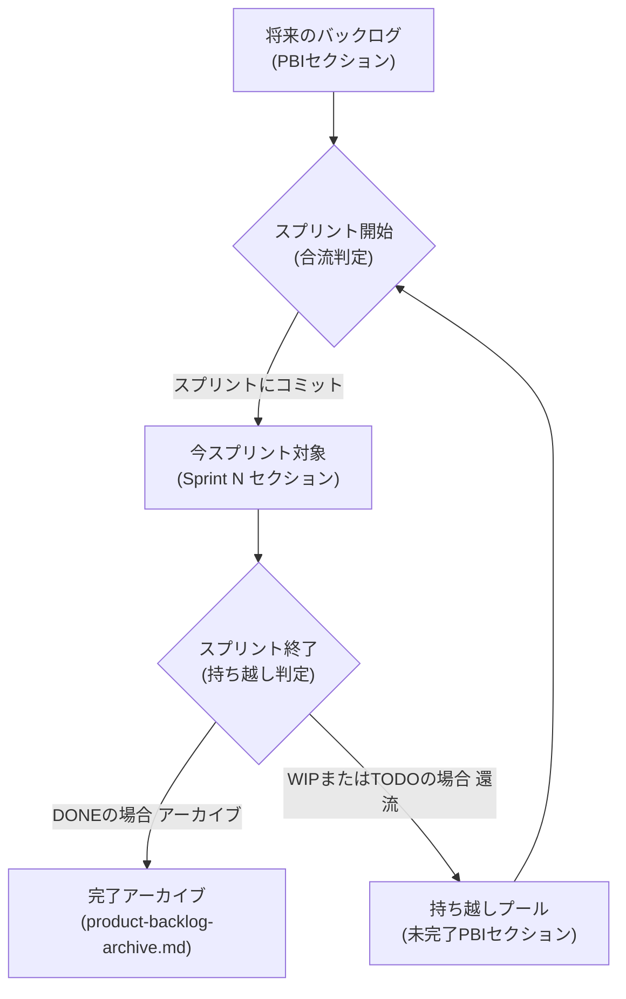
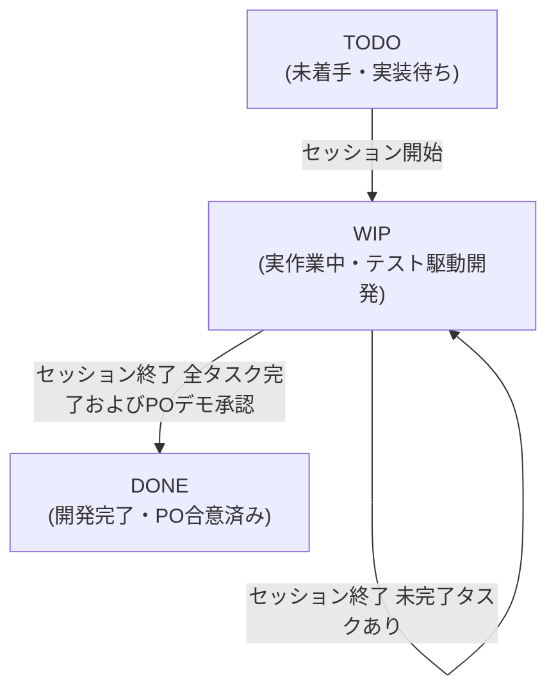

# プロダクトバックログ運用ガイドライン

このドキュメントは、プロジェクトにおけるプロダクトバックログの管理・運用の標準ルールを定義します。

## 1. 用語定義 (Glossary)

- **PBI (Product Backlog Item)**:
  プロダクトバックログアイテム。実現すべき機能や技術的タスクの最小管理単位。
- **スプリント (Sprint)**:
  複数のPBIをまとめて開発・検証し、インクリメント（価値）を生み出すための一定の期間枠。
- **セッション (Session)**:
  エージェントまたは人間が1回の作業として連続して稼働する時間の単位。原則として「1セッションで1つのWork
  Packageを完了させる」。
- **プロダクトゴール**: スプリントを通じて最終的に目指すべき唯一の到達目標。

## 2. 概念定義 (Concepts & Guidelines)

### 2.1. プロダクトゴールとバックログの構造

- 同時に存在するゴールは **常に 1 つ** です。
- ゴールが達成または放棄されたら、履歴テーブルに記録した上で新しいゴールを策定します。
- **バックログの構造**:
  - 小規模プロジェクト: PBI のフラットリスト。
  - 中・大規模プロジェクト: `Epic > Feature > PBI` の階層構造（任意）。
- **PBI フォーマット**:
  - **概要** と **受け入れ基準 (AC)** の記載を必須とします。
  - ユーザーストーリー形式（「～として～したい」）は推奨ですが、技術タスク等の場合は必須ではありません。

### 2.2. PBI の見積り基準 (T-Shirt Size)

AI 開発における見積りは、コード量ではなく **「人間の介入（ハンドオフ）がどれくらい発生しそうか」**
を基準にします。

| サイズ | ウェイト | 判断基準の目安                                                 |
| ------ | -------- | -------------------------------------------------------------- |
| **S**  | 2        | 明確な単一タスク。エージェントがほぼ自律で完了可能。           |
| **M**  | 3        | 複数ステップ。1〜2回の人間による確認・方針修正が必要。         |
| **L**  | 5        | 設計判断を含む。複数回の議論やレビューが必要な複雑なタスク。   |
| **XL** | 8        | アーキテクチャ変更。不確実性が高く、複数セッションにまたがる。 |

### 2.2.2. 推奨スプリントウェイト上限 (Recommended Sprint Weight Cap)

1スプリントに詰め込むPBIの合計規模を制御し、エージェントのコンテキスト肥大化や迷走を防ぐため、スプリント全体の「合計ウェイト」に推奨上限を設けます。

- **初期の推奨上限値**: **6** (Mサイズ2個分、またはSサイズ3個分相当)
- **動的変動ルール**:
  この上限値は固定ではなく、チームの実際の過去スプリントの実績ベロシティ（生産性）に応じて、スプリント終了時の振り返り（Sprint
  End）において見直され、動的に変動する性質のものです。
- **リスク合意プロセス**:
  スプリントプランニング時に、計画されたPBIの合計ウェイトが設定された上限値を超過する場合は、POと開発チーム（エージェント）との間で、詰め込みによる品質低下や迷走リスクに関する明確な合意（リスク合意）を得る必要があります。

### 2.2.1. Work Packageの見積り基準 (Effort = 人間の介入回数)

AI 開発の実作業はセッション（1回ごとのAIとの対話セッション）を最小単位として進行します。
セッションレベルでの労力（Effort）は、**「AIに対する人間の介入回数（具体的な数値）」**
として測定します。 将来的にAIの自律性が高まり、人間の介入が `0` になれば、そのWork
Packageをこなすための人間の Effort は最小化されます。

#### 1. 介入（Intervention）の定義

以下の行為がPO（人間）から発生した場合に、介入回数を `1回` としてカウントします。

- **意図の修正指示（やり直し）**:
  AIが意図を誤認して実装したため、「そうではなく、このように修正して」と再指示すること。
- **制約・ルールの違反指摘**: 計画外ファイルの編集や絶対パスの使用など、規律の逸脱を指摘すること。
- **アプローチの軌道修正**: 設計のトレードオフ議論を経て、実装方針を大がかりに変更すること。 ※
  プロセスの単なる進行指示（「次へ」「進めて」など）や、AIからの純粋な質問に対する1往復の回答は介入に含めません。

#### 2. 3点見積もりによるボトルネック分析

セッション内の意思決定とプロセス管理のボトルネックを特定するため、以下の3段階で Effort
を記録します。

1. **初期見積もり (Initial Estimated Effort)**:
   - **タイミング**: Work Package選択時 (`identify-session-task`)
   - **定義**: Work Package自体の記述や要件定義の明瞭さから、開始時点で想定される介入回数。
2. **計画後見積もり (Planned Estimated Effort)**:
   - **タイミング**: 計画完了・PO合意時 (`session-planning`)
   - **定義**:
     計画策定段階でのPOとのすり合わせの多さや、詳細化によって明確になった技術的難易度を加味した最終予測値。
3. **実績 (Actual Effort)**:
   - **タイミング**: セッション終了・メトリクス記録時 (`record-session-metrics`)
   - **定義**: 実装フェーズにおいて、実際に発生したPOの介入回数の実績値。

#### 3. 乖離データによる改善アプローチ

3点見積もりの乖離パターンから、開発・管理における課題を科学的に特定します。

- **初期見積もり < 計画後見積もり (プランニング時の乖離)**:
  - 原因：Work
    Packageの初期記述が曖昧、または要求定義が不十分だったため、計画合意までにPOの多くの割り込みや修正指示を要した。
  - 対策：バックログ登録時のAC（受け入れ基準）記述の精度を高める。
- **計画後見積もり < 実績 (実装時の乖離)**:
  - 原因：計画段階では見通しが良かったが、実際のコード実装でAIが迷走したり、予期せぬエラーで手戻りが発生した。
  - 対策：AIの技術的コンテキストの与え方を改善するか、計画のステップをさらに細分化する。

### 2.3. スプリント境界の管理ルール

開発チームの計画性と進捗管理を規律化するため、プロダクトバックログに **スプリント境界**
を導入します。

- **明示的な境界と範囲定義**:
  - **開始位置**: `[product-backlog.md](.agents/management/product-backlog.md)` 内のH2見出し
    `## Sprint N` （Nは現在のスプリント番号）
  - **終了位置**: `[product-backlog.md](.agents/management/product-backlog.md)` 内のH2見出し
    `## 将来のバックログ`
  - **スプリントバックログ**:
    開始位置から終了位置の間にあるPBIを今スプリントの対象領域として扱います。
- **POによる意志決定**:
  - スプリント境界は、スクリプト等で自動的に決定されるものではありません。
  - スプリントプランニング時、プロダクトオーナー（PO）が「今回のスプリントではここまで対応する」とコミット範囲を検討し、`## Sprint N`
    の下にPBIを配置して宣言します。

### 2.4. セッションとスプリントの管理

AI との協働において、コンテキストの汚染（迷走）を防ぎ、品質を維持するための最重要ルールです。

- **1 セッション = 1 Work Package（PBIの一部）**:
  - 1 つのセッション（チャットの往復から終了まで）で取り組むのは、原則として細分化された 1 つのWork
    Packageのみです。
  - セッションを「スプリント」と同一視し、複数の PBI を詰め込むことは **厳禁** です。
- **コンテキストの保護**:
  - 作業量が膨大になると予想される場合は、セッションを開始する前に PBI をさらに細分化し、1
    セッションで完結できるサイズに調整します。
- **セマンティック分割 (Semantic Splitting)**:
  - PBIを細分化する際は、物理的なファイル数や修正量ではなく、**「単一のユースケース、ユーザーストーリー、または明確に独立した機能・ルールの変更境界」**を基準として行います。無関係な複数の変更意図が1つのPBIに混在することを禁止します。
  - **適切な例**:
    - 「パスワードリセット機能の作成（UIとAPIの実装）」：1つのユースケースの境界に閉じているため適切。
    - 「バックログガイドラインの作成」と「スプリントプランニングスキルの出力形式の修正」：同じスプリント管理の関心事ではあるが、ガイドライン定義とスキル動作という別個の変更境界であるため、2つのPBIに分割するのが適切。
  - **不適切な例**:
    - 「バグ修正とリファクタリング」：バグ修正という問題解決と、外部挙動を変えないリファクタリングという無関係な意図が混在しているため不適切。
    - 「ユーザー登録機能の開発および設定ファイルのバリデーション追加」：2つの独立したユースケース・動作が含まれているため不適切。
- **完了の定義 (DoD)**:
  - セッションの終了（DONE）は、対象のWork Packageが AC を満たし、かつ
    PO（ユーザー）が「次のセッションへ進める」と判断した時点を指します。

## 3. 状態遷移 (Lifecycle & State Transitions)

PBIの開発・管理の理解を最も容易にするため、「PBIが物理的にどこに配置されるか（所在の遷移）」と「PBI・タスクそのものの進捗がどう変化するか（状態の遷移）」の2つに関心を完全に分離して定義します。

### 3.1. PBIの「所在 (配置)」のライフサイクル

PBIデータが、ファイルシステムやMarkdownのセクション間をどのように移動していくかを示します。

- **将来のバックログ**:
  まだスプリントで対応する予定のない、将来的な優先度順のTODOアイテムの配置場所。
- **持ち越しプール**:
  前スプリントで未完了（WIP/TODO）のまま終了したPBIが、一時的に還流・退避されるプール。スプリント開始時に再度POによりスプリントへ合流させるかどうかが検討されます。
- **今スプリント対象**: 現在のスプリント（Sprint N
  セクション）にコミットされ、セッション開発の対象となっている配置場所。
- **完了アーカイブ**:
  すべてのタスクが完了しPO承認を得たPBIが、`[product-backlog-archive.md](.agents/management/product-backlog-archive.md)`
  に永続保管された場所。

### 3.2. PBI・タスクの「ステータス (進捗状態)」のライフサイクル

スプリント実施期間（セッションサイクル）において、PBIやそれに付随するタスクそのものがどのような進捗状態を辿るかを示します。PBIのステータスは、その配下の
**タスクリストのチェック状態から自動的に導出** されます。

- **TODO**: 全てのタスクが未完了（`[ ]`）であり、作業が全く手をつけていない初期状態。
- **WIP (Work In Progress)**:
  実作業が開始された状態。少なくとも1つのタスクが着手中または完了しているが、未完了のタスクが残っている状態。PBIのタスクが複数ある場合、1回のセッションで完了しきれないことが多いため、セッション終了時に未完了タスクがあれば「WIP状態のまま」セッションを終え、次のセッションでWIPとして継続されます（自己還流）。
- **DONE**:
  全てのタスクが完了（`[x]`）し、POへのデモを通過して最終承認を得た状態。この状態で初めてアーカイブ手順へと進むことができます。

## 4. 手続き (Procedures)

### 4.1. アーカイブ手順

**スプリント終了（Sprint End）の儀式において**、ステータスが `[DONE]` になっている PBI
に対して、一括して以下の手順でアーカイブを行います。

1. PBI を「インクリメントカード形式（完了日、知見、成果物等）」に書き換える。
2. `[product-backlog.md](.agents/management/product-backlog.md)` から削除する。
3. `[product-backlog-archive.md](.agents/management/product-backlog-archive.md)`
   の最上部に追記する。

### 4.2. 知見タグ（Category）の運用

アーカイブされる PBI には、将来の検索・再利用性を高めるために、以下のカテゴリタグを 1
つ以上付与します。

- **`#Troubleshooting`**: 特定のエラー、バグ、ハマり所の具体的な解決策。
- **`#Decision`**: アーキテクチャ、技術選定、優先順位に関する重大な意思決定と判断根拠。
- **`#Pivot`**: 計画の変更、戦略の転換、およびその背景となった状況の変化。
- **`#Architecture`**: コンポーネント間の関係、データフロー、ディレクトリ構造の設計意図。
- **`#Efficiency`**: 自動化、ツール活用、開発プロセスの改善による効率化の知見。
- **`#Lesson`**: プロセス上の反省、コミュニケーション、役割分担の最適化。

**価値判断の継承**: 特に `#Decision` や `#Pivot`
タグを付与することで、将来のセッションにおいて「なぜ現在の構造になっているのか」という問いに対し、当時の判断背景を
1 ターンで再発見できるようになります。
