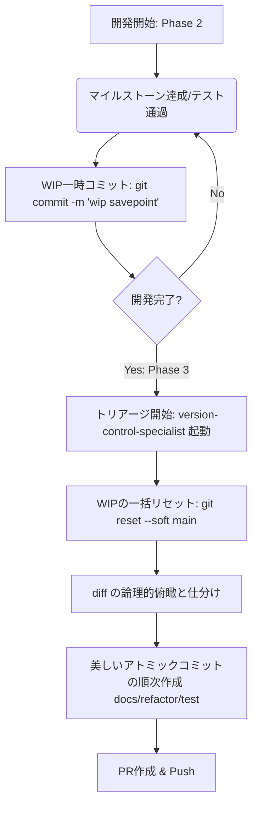

# 🧬 AI向けハイブリッド・トリアージ・コミットプロセス (Hybrid Triage Commit Process)

本ドキュメントは、AIエージェントの「開発中のアテンション（注意資源）枯渇問題」を回避しつつ、Gitにおける「芸術的に美しいアトミックコミット」を
100%
確実に両立させるための、バージョン管理システムとAIの特性を完全に合致させた最高水準のコミット運用規格です。

> [!CAUTION]
> ⚠️ **超重要：ローカル運用ファイルのデータ喪失防止警告** `.agents/management/`
> ディレクトリ配下（`product-backlog.md` 等の実働管理ファイル）、および `config/`
> ディレクトリ配下（各種設定ファイルの実体）は、 **.gitignore にて
> Gitの追跡から意図的に除外**されています。
> したがって、AIがステートレスリセット時やブランチ切り替え時に `git clean -fdx`
> などの強力なクリーンアップ操作を独断で実行すると、これらの貴重な**ローカル実働データが永久に物理消滅します**。
>
> `git clean` や `git reset --hard` などの 履歴変更系コマンドを実行する際は、 `[CRITICAL ACTION]`
> を宣言し、PO（ユーザー）の明確な承認を得ると同時に、事前バックアップを必ず確保せよ。

---

## 💡 背景と課題

AIエージェントが認知ロードの高い開発作業（大量のリファクタリング、難解なデバッグ等）にアテンション（注意窓）の
90%
を割いている時、進捗の更新タイミングや、プッシュ前の静的解析、あるいはこまめな「アトミックコミットの切り出し」といったメタ的なプロセス管理に割くアテンションが一時的に枯渇します。

その結果、「動作したが、すべての変更が
1つの巨大なコミットに雑にまとめられてしまう」というアトミックコミットの破綻が発生しやすくなります。

---

## 🏆 ハイブリッド・トリアージ戦略 (The Hybrid Triage Strategy)

AIエージェントに「人間と同じようにこまめに思考を切り替えてアトミックにコミットせよ」と強制するのではなく、**AIの強みである「事後の膨大なdiffの俯瞰・論理的分析力」を最大化する設計**にプロセスを寄せます。

### 1. WIP一時コミットによる自動セーブ (開発中)

- 開発フェーズ（Phase
  2）の実行中、テストが新しくパスした瞬間や、重要なファイル書き換えが成功した瞬間ごとに、AIは
  `git commit -am "[wip] savepoint"` などの一時的なセーブポイントを作成します。
- **効果**: 途中で試行錯誤が失敗したりコードが壊れた場合、いつでも `git checkout`
  で過去の動いていた状態に切り戻す（Revertability）ことができ、AIの認知的不安を解消します。

### 2. ポストトリアージによる「歴史の編纂」 (プッシュ直前)

- 開発およびすべてのローカル検証（fmt / lint）が完了した完了フェーズ（Phase 4 または Phase
  5）の冒頭で、`[version-control-specialist.md](/.agents/rules/version-control-specialist.md)`
  ロールを呼び出し、`[hybrid-triage-commit](/.agents/skills/bundles/git-bundle/hybrid-triage-commit/SKILL.md)`
  スキル（`triage` モード）を実行します。
- これまで積み重ねた WIP コミットを `git reset --soft origin/main`
  などで一旦ステージング状態に戻し、全変更の diff を俯瞰します。
- 意味のある論理的なアトミックコミット（例：`[test] ...`, `[refactor] ...`, `[fix] ...`）へと
  **完璧に事後トリアージして再構築（歴史の編纂）します**。

---

## 💎 メリット

1. **アテンションの最大化（シングルタスク）**: 開発中は「動くコードを書くこと」だけに 100%
   集中できるため、認知限界を超えずに品質の高い実装が完走できます。
2. **履歴の圧倒的な美しさ（論理的整合性）**:
   未来の確定した時点（すべてが動き検証された状態）から過去を遡ってコミットを切り出すため、無駄な試行錯誤や手戻りバグが一切含まれない、芸術的なストーリー性を持った履歴が誕生します。
