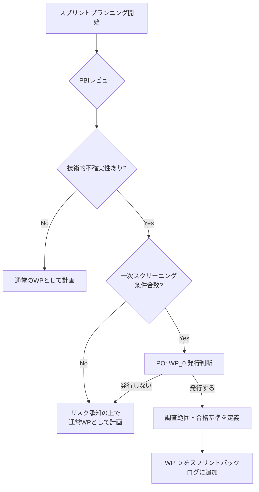

# スプリントプランニング時におけるスパイクWP (`WP_0`) の発行判断

本ドキュメントは、スプリントプランニングの場において技術的不確実性を検出し、プロダクトオーナー（PO）の判断でスパイクWP（`WP_0`）を発行するための基準と手順を定義する。

スパイクWP自体の概念定義については
[backlog-guidelines.md 2.2.3](/.agents/management/backlog-guidelines.md#223-スパイクwp-spike-work-package)
を参照すること。

## 技術的不確実性の検出タイミング

スプリントプランニング時の以下の場面で技術的不確実性を検出する：

| 場面         | 確認項目                                                          |
| ------------ | ----------------------------------------------------------------- |
| PBIレビュー  | 要求事項の実現可能性が不明確、技術的制約が未知                    |
| 見積もり議論 | 見積サイズが2段階以上プレる、チーム内で実現方法の見解が一致しない |
| 依存関係確認 | 外部サービス・ライブラリの仕様が未確定、連携方式の検証が必要      |
| AC定義       | 受入基準の一部が「調査結果次第」に依存している                    |

## `WP_0` 発行判断基準

以下の条件に合致する場合、POはスパイクWP（`WP_0`）の発行を検討する：

### 一次スクリーニング（発行要否の判定）

- **技術検証の要否**: POとAI（開発チーム）の間で実現方法の見解が一致しない、または確定に検証を要する
- **見積の不安定性**: 同一PBIの見積サイズがチーム内で2段階以上乖離する
- **外部依存の未確定**: 使用予定のライブラリ・API・サービスの仕様や挙動が未確認
- **アーキテクチャへの影響**: 選択肢によって後続PBIの設計が大きく変わる可能性がある

### 調査範囲の決定

`WP_0` 発行時には以下の範囲制限を設定する：

| 項目         | 制限の指針                                                       |
| ------------ | ---------------------------------------------------------------- |
| **時間枠**   | 最大2時間相当の調査（セッション1回分を上限とする）               |
| **検証項目** | 調査で確認すべき項目を箇条書きで列挙し、PO承認を得る             |
| **合格基準** | 調査結果をもとに本実装WPが計画可能な状態になること               |
| **成果物**   | 調査レポート（後続の本実装WPのバックログに参照リンクとして明記） |

### キャパシティ考慮

- `WP_0`
  の発行はスプリントキャパシティに影響を与える可能性があるため、POは発行時に予備バッファを考慮する
- スプリントの合計ウェイトに余裕がない場合、POは既存PBIの優先順位を再評価し、必要に応じてスコープ調整を行う

## 発行判断フロー

