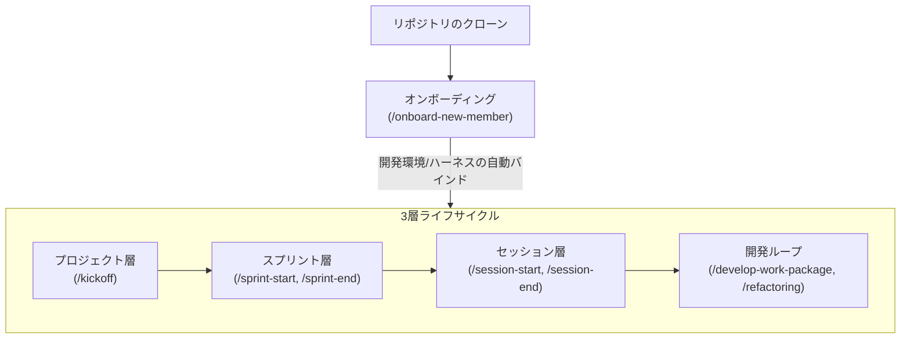

# Global Harness Manager

このリポジトリは、AIエージェントの役割（Role）・スキル（Skill）・およびワークフロー（Workflow）を「Bundles（束）」として管理し、プロジェクトの規律をシステムレベルで統制する
**グローバルハーネス** です。

## 思想と目的 (Harness Engineering)

本リポジトリは、AIを単なる「作業の丸投げ先」にせず、人間とAIが共に成長する **AI-Human Co-evolution**
を目指しています。

1. **規律のポータビリティ**:
   どのプロジェクトでも、このハーネスを「装着（Attach）」するだけで、定義された高品質な開発プロセスが即座に適用されます。
2. **役割と責任の分離**: `Architect`, `Developer`, `Tester`
   といった明確な役割をAIに与え、各ステップで厳格な制約（DoD等）を課すことで、品質と透明性を確保します。
3. **教育的協働**:
   AIに対して意思決定の背景やトレードオフの説明義務を課すことで、ユーザー自身が「設計・管理者」としての視座を磨くことができます。

---

## ハーネスの導入と利用方法 (Getting Started)

ハーネスの利用は、Antigravity（エージェント）との対話を通じて、以下の流れで行われます。クローン後の「オンボーディング」によってすべての実行環境が自動的に整備され、3層ライフサイクルを直ちに運用可能になります。

### 1. 導入：オンボーディング (Onboarding)

リポジトリをクローンした後、まずはじめにオンボーディングを実行します。

- **オンボーディング実行**: `> 「/onboard-new-member を実行して」`
  - CLIツールの導入確認、セキュリティ保護、およびプロジェクトへのハーネス（役割・スキル・ワークフロー）の自動バインドが一括で行われます。
  - これにより、インフラ構築に迷うことなく、即座に次の「3層ライフサイクル」を実行できる状態が整います。

### 2. 3層ライフサイクル (3-Tier Lifecycle Architecture)

オンボーディング完了後、以下の3つのレイヤー（プロジェクト、スプリント、セッション）に分かれたライフサイクルを順に回しながら、規律ある開発を進めます。

#### ① プロジェクトライフサイクル (Project Lifecycle)

- **プロジェクト開始**: `> 「/kickoff を実行して」`
  - プロジェクトの存在価値やビジョン、技術スタックを批判的に検証し、開発開始の合意を形成します。

#### ② スプリントライフサイクル (Sprint Lifecycle)

- **スプリント開始**: `> 「/sprint-start を実行して」`
  - バックログのリファインメント、スプリント計画、および受入基準 (AC)
    の定義を1ステップずつ対話的に進め、コミット範囲を確定します。
- **スプリント終了**: `> 「/sprint-end を実行して」`
  - スプリントレビュー、KPT形式での振り返り、品質メトリクスの分析、およびスキルの最適化を段階的に行い、完了PBIをアーカイブします。

#### ③ セッションライフサイクル (Session Lifecycle)

- **セッション開始**: `> 「/session-start を実行して」`
  - スプリント内のPBIから今回取り組む単一のタスクを特定し、専門ロール（開発者や設計者など）が詳細な実装計画（`implementation_plan.md`）とタスクリスト（`task.md`）を策定します。
- **タスク開発**: `> 「/develop-work-package を実行して」` (または `/refactoring`)
  - 計画とTDD（テスト駆動開発）に基づき、安全にコードの実装・改善をループ実行します。
- **セッション終了**: `> 「/session-end を実行して」`
  - 成果を要約し、KPT形式で振り返りを行い、予実差と品質メトリクスを記録して終了します。

### 3. ワークフローコマンド一覧

| フェーズ           | コマンド                                 | 目的                                                | 実行タイミング          |
| ------------------ | ---------------------------------------- | --------------------------------------------------- | ----------------------- |
| **導入**           | `> 「/onboard-new-member を実行して」`   | CLI導入確認・認証設定・ハーネスの自動バインド       | クローン直後、最初に1回 |
| **プロジェクト層** | `> 「/kickoff を実行して」`              | ビジョン策定・技術スタック選定・開発開始の合意形成  | 新規プロジェクト開始時  |
| **スプリント層**   | `> 「/sprint-start を実行して」`         | バックログリファインメント・スプリント計画・AC定義  | 各スプリント開始時      |
|                    | `> 「/sprint-end を実行して」`           | スプリントレビュー・KPT・メトリクス分析・アーカイブ | 各スプリント終了時      |
| **セッション層**   | `> 「/session-start を実行して」`        | タスク特定・実装計画（implementation_plan.md）策定  | 各セッション開始時      |
|                    | `> 「/develop-work-package を実行して」` | TDD実装ループ                                       | タスク着手時            |
|                    | `> 「/refactoring を実行して」`          | リファクタリングループ                              | コード改善時            |
|                    | `> 「/session-end を実行して」`          | 成果要約・KPT・メトリクス記録                       | 各セッション終了時      |

---

## ディレクトリ構成

- `.agents/`: ハーネスの中核となるエージェント資源。
  - `skills/bundles/`: 機能ごとにカプセル化されたスキル群。
    - `onboarding-bundle`: 環境構築や検証に関わるスキル。
    - `management-bundle`: 計画策定やバックログ管理に関わるスキル。
    - `development-bundle`: TDD実装やサンドボックス構築に関わるスキル。
    - `meta-bundle`: エージェント自身の最適化や文脈同期に関わるスキル。
  - `rules/`: 各ロール（専門家）の行動指針と制約。
  - `workflows/`: タスク完遂までの標準化された手順書。
  - `management/`:
    プロジェクトの頭脳。ビジョン、バックログ、および実施中の実装計画書（Implementation
    Plan）を管理。
  - `core/`: ハーネス全体で共有される共通ユーティリティ。
- `config/`: 環境固有の設定。`.example` ファイルを元に作成します。
