# アーキテクチャ設計 (Architecture Design)

**3階層アーキテクチャ — Skill層 / Domain層 / Gateway層**

本ドキュメントは、L1（運用ガイド、`/guides/operations-guide.md`）の概念フレームワークと
L2（設計仕様、`/guides/design-spec.md`）の属性・インターフェース定義を、具体的な実装設計へと落とし込む
**L3（アーキテクチャ設計）** です。

---

## 第1章: アーキテクチャ設計の目的と適用範囲

### 1.1. なぜ3層アーキテクチャが必要か

L1（運用ガイド）は以下の責務分離を定義している。

| 主体           | 責務                                                           |
| -------------- | -------------------------------------------------------------- |
| **人間（PO）** | 「何をすべきか」の意思決定 — 優先順位、ACの承認、完了の判断    |
| **AI**         | 「どのように実装するか」の実行、構造化データの管理、情報の提供 |

この責務分離をソフトウェアアーキテクチャとして実現するために、AIが実行する処理を
**3層のアーキテクチャ**
に分割する。各層は単一責任を持ち、上位層は下位層の詳細を知らずにインターフェース経由で呼び出す。

```
┌──────────────────────────────────────────────────┐
│                   Skill層                         │
│  役割: ユーザー/ワークフローとのインターフェース   │
│  責務: 入力変換、結果表示、スキル制御              │
├──────────────────────────────────────────────────┤
│                   Domain層                        │
│  役割: ビジネスルールと計画生成                     │
│  責務: バリデーション、計画生成、状態管理           │
│  特徴: 純粋ロジック、外部依存なし                   │
├──────────────────────────────────────────────────┤
│                   Gateway層                        │
│  役割: 外部サービスとの通信                         │
│  責務: GitHub API操作、ファイルI/O、データ永続化    │
│  特徴: 実装の差し替えが可能（gh CLI / GraphQL等）  │
└──────────────────────────────────────────────────┘
```

### 1.2. 適用範囲

本アーキテクチャ設計が対象とする範囲:

- **対象**: プロジェクト管理情報（PBI/WP/Review/Retrospective等）を GitHub Issues / Projects V2
  上で操作する全スキル
- **非対象**: 対話型スキル（`craft-vision`, `product-backlog-refinement`
  等、GitHub操作を伴わないもの）、開発環境そのもののセットアップ（`setup-harness-env` 等）

### 1.3. 設計順序

DIP（依存性逆転）に基づき、各層は以下の順序で設計する。

1. **Domain層（最優先）**: ビジネスルールとポート（インターフェース）を定義する。外部依存ゼロ。
2. **Skill層**: Domain層の公開APIを呼び出す形で設計する。Domain層の型に依存する。
3. **Gateway層**: Domain層のポートを実装する形で設計する。Domain層の型に依存する。

この順序により、Domain層が外部技術（GitHub / GitLab /
ファイルシステム等）に一切影響されない純粋なビジネスロジック層として確立される。

### 1.4. 前提条件

- 運用基盤は GitHub Issues / Projects V2 とする（L1 3.5節の選定判断に基づく）
- CLI は `gh` を使用する（Gateway層のデフォルト実装）
- 全スキルは `dry-run` モードをサポートする（第6章で定義）
- 本ドキュメントは L1/L2 の上位設計に従う。L1/L2
  と矛盾が生じた場合は本ドキュメントを優先する（本ドキュメントが最も具体性の高い実装設計であるため）

---

## 第2章: 3層アーキテクチャの責務分離

### 2.1. 設計思想

3層アーキテクチャは以下の原則に基づく。

| 原則                     | 内容                                                         |
| ------------------------ | ------------------------------------------------------------ |
| **単一責任**             | 各層は1つの責務のみを持つ                                    |
| **依存方向の統一**       | 上位層は下位層に依存するが、下位層は上位層に依存しない       |
| **インターフェース分離** | 層間の通信はインターフェース経由で行い、具象実装に依存しない |
| **置換可能性**           | 下位層の実装を差し替えても上位層に影響しない                 |

### 2.2. 各層の責務

#### Skill層（Interface層）

```
責務: ユーザー/ワークフローからの要求を受け付け、Domain層に処理を委譲し、結果を返す
```

| 担当                                                    | 非担当                   |
| ------------------------------------------------------- | ------------------------ |
| ワークフローからの入力（CLI引数・stdin JSON等）のパース | ビジネスルールの検証     |
| 入力値の基本フォーマット検証（型変換）                  | 状態の永続化             |
| Domain層から返された結果の表示整形                      | GitHub APIの直接呼び出し |
| エラーメッセージのユーザー向け変換                      | 計画の生成・判断         |
| dry-runフラグの解釈と分岐制御                           |                          |

**入力パースの具体例**: スキル `pbi-open`
は、以下のようにワークフローからJSONを受け取り、Domain層の型に変換する。

```json
// ワークフローからSkill層への入力（stdin）
{ "title": "ユーザー認証機能", "body": "ログイン画面の実装", "size": "M" }
```

```typescript
// Skill層での処理（概念）
function handlePbiOpen(input: string): void {
  const raw = JSON.parse(input); // stdinのパース
  const plan = domain.pbiを発案する({ // Domain層の公開APIを呼び出し
    title: raw.title,
    description: raw.body,
    estimatedSize: raw.size as SizeEstimate,
  });
  if (context.dryRun) {
    console.log(formatPlan(plan)); // dry-run時は計画を表示して終了
    return;
  }
  const result = domain.executePlan(plan); // 実実行
  console.log(formatResult(result));
}
```

各スキル（`pbi-open`, `wp-create`, `pbi-update`
等）はこの層に属する。スキル名は動作対象（GitHub等）を含まず、業務操作を表す汎用的な命名とする。これによりGateway層の実装を差し替えても（例:
GitHub → GitLab）スキル名を変更する必要がなくなる。

#### Domain層（Business Logic層）

```
責務: ビジネスルールの検証、計画生成、状態の管理
```

| 担当                                                     | 非担当               |
| -------------------------------------------------------- | -------------------- |
| コマンドの意味的検証（例: 「完了したWPを再開できない」） | ユーザー入力のパース |
| 操作の可否判断（状態遷移の正当性）                       | GitHub APIの呼び出し |
| dry-run時の計画オブジェクトの生成                        | ファイルI/O          |
| バリデーションエラーの生成                               | 結果の表示           |

Domain層は **外部依存を持たない純粋なロジック層** である。GitHubのAPI型（`Issue`, `ProjectV2Item`
等）には一切依存せず、自身のインターフェース型（関数シグネチャ・引数型・抽象クラスのプロパティ）のみを定義する。

```typescript
// Domain層が定義する型の例（実際の実装言語に依存しない概念表現）
interface CreatePbiPlan {
  readonly title: string;
  readonly description: string;
  readonly parentFeatureId?: string;
  readonly estimatedSize: SizeEstimate;
}

type SizeEstimate = "XS" | "S" | "M" | "L" | "XL";

interface ValidationResult {
  readonly valid: boolean;
  readonly errors: readonly ValidationError[];
}
```

#### Gateway層（Infrastructure層）

```
責務: 外部サービスとの通信、データの永続化
```

| 担当                                       | 非担当                                                   |
| ------------------------------------------ | -------------------------------------------------------- |
| GitHub API（gh CLI）の呼び出し             | ビジネスルールの判断                                     |
| Domain層の型とGitHub API型のマッピング     | ユーザー入力の解釈                                       |
| ファイルI/O（設定ファイルの読み書き）      | エラーメッセージの翻訳（Domain層の例外型をそのまま伝搬） |
| ネットワークエラーのDomain層例外型への変換 |                                                          |

Gateway層はDomain層が定義するインターフェースを実装する。Domain層の型をGitHub
APIの型にマッピングする役割を担う。

```typescript
// Gateway層で行う型マッピングの概念
// Domain層の CreatePbiPlan → gh CLI の引数へ変換
function toGhCliArgs(plan: CreatePbiPlan): string[] {
  const args = ["gh", "issue", "create", "--title", plan.title, "--body", plan.description];
  if (plan.estimatedSize) args.push("--field", `harness-size-estimate=${plan.estimatedSize}`);
  return args;
}
```

### 2.3. 依存方向と層の関係

本アーキテクチャは **Dependency Inversion Principle (DIP)**
を適用する。Domain層がインターフェース（ポート）を定義し、Gateway層がそれを実装する（アダプター）。これにより、**制御の流れ**
と **依存の方向** が逆転する。

```
       制御の流れ（呼び出し方向）
       ──────────────────────────►

      Skill層（スキル）
          │
          ▼
      Domain層（ビジネスロジック）
          │          ▲
          ▼          │
      Gateway層──────┘
          │     依存の方向（インターフェース）
          ▼
      GitHub API / ファイルシステム
```

**制御の流れ（呼び出し方向）**: Skill → Domain → Gateway

- Domain層はGateway層の実装（具象クラス）のメソッドを呼び出す

**依存の方向（インターフェース）**: Skill → Domain ← Gateway

- Domain層は自身が定義する **抽象インターフェース（ポート）** のみを知っている
- Gateway層はDomain層が定義するインターフェースを **実装（アダプター）** する
- したがって依存の矢印は Gateway → Domain の方向になる

**依存のルール**:

- Skill層 → Domain層: Skill層はDomain層の公開APIに依存する
- Gateway層 → Domain層: Gateway層はDomain層の定義するインターフェースに依存する
- Domain層はGateway層の存在を知らない（インターフェースのみを持つ）
- Skill層はGateway層を直接呼び出してはならない（必ずDomain層を経由する）

```typescript
// Domain層が定義するポート（インターフェース）
interface IssuePort {
  create(input: IssueInput): IssueOutput;
  update(issueNumber: number, input: IssueInput): void;
  close(issueNumber: number): void;
}

// Gateway層がDomain層のポートを実装する（依存方向: Gateway → Domain）
class GhCliIssueAdapter implements IssuePort {
  create(input: IssueInput): IssueOutput {
    // gh CLI を呼び出す実装
    const result = execSync(`gh issue create --title "${input.title}" --body "${input.body}"`);
    return { number: parseIssueNumber(result), url: result.trim() };
  }
  // ...
}

// Domain層はIssuePortインターフェースのみを知っている
// 具象クラス（GhCliIssueAdapter）の存在は知らない
```

### 2.4. 層の置換可能性

Gateway層の実装は、インターフェースの契約を満たしていれば差し替え可能である。

| 現在の実装       | 代替可能な実装           | 影響範囲      |
| ---------------- | ------------------------ | ------------- |
| `gh` CLI 経由    | GraphQL API 直接呼び出し | Gateway層のみ |
| `gh` CLI 経由    | REST API 直接呼び出し    | Gateway層のみ |
| ローカルファイル | クラウドストレージ       | Gateway層のみ |

Domain層とSkill層はGateway層の実装の詳細を知らないため、交換による影響はGateway層に閉じる。

### 2.5. アーキテクチャ全体図（Mermaid）

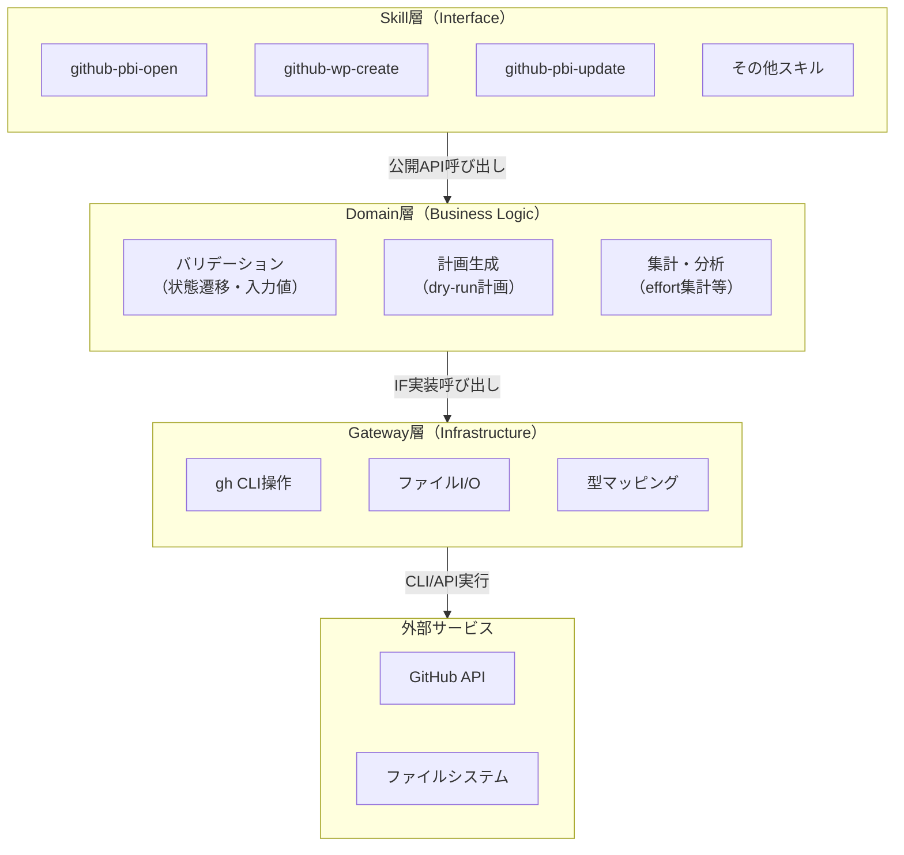

**矢印の意味**: 呼び出し方向（依存方向）。矢印の先が「知っている側」。

---

## 第3章: 層間インターフェース契約

### 3.1. 設計方針

API名は **業務用語** で統一する。POや新人でも直感的に操作意図を理解できるようにするため、`addItem`
や `updateRecord` 等の汎用操作名は使用しない。

命名パターン: **対象インスタンス + 操作**（業務ライフサイクル上の意味を持つ動詞）

| 推奨（業務用語）                 | 非推奨（汎用） |
| -------------------------------- | -------------- |
| `PBIを発案する` / `WPを定義する` | `createItem`   |
| `PBIに着手する` / `WPを完了する` | `updateStatus` |
| `PBIを保管する`（アーカイブ）    | `closeItem`    |

#### 共通設計パターン

全UseCaseの操作は、以下の共通ルールに従う。

**識別子の型化**:
各概念を一意に指す識別子はプリミティブ型ではなく、Identifierを継承した具象型として定義する。これにより、異なる概念の識別子を間違って渡す事故を型レベルで防止する。個別取得操作はこの識別子を引数に取り、単一のData型を返す。

**実体情報と識別子の分離**:
Data型はIdentifier（識別子）とStatement（実体情報）を分けて保持する。Statementには業務記述や属性が含まれ、PBI/WP/Retrospective等の一部の概念はこれに加えてプロセス証跡（ProcessEvidence）やメトリクスも持つ。

**変更操作はPlanを返す**:
状態を変更する操作は、実際の変更を実行する前に「これから行う操作の設計図（Plan）」を返す。1つの業務操作が複数のStepに分解されることがあり（例:
WP完了と連動する親PBIの状態更新）、PlanはそれらをStepのリストとして保持する。詳細は第6章。

**dry-runの共通扱い**:
dry-runは変更・取得の両方で共通の仕組みで動作する。変更操作の場合はPlanの内容を表示し、取得操作の場合は入力型（SearchConditionやIdentifier）のdescribe()メソッドで検索条件や取得対象を説明する。いずれの場合もGateway層の呼び出しは行われない。詳細は第6章。

**変更理由の記録**: 業務内容の変更を伴う操作（pivot, redefine, assign,
set等）は理由（ChangeReason）を引数として受け取る。ただし純粋な状態遷移（commit, start, complete,
archive等）は理由を必要としない。

**検索の統一**: 一覧検索はSearchConditionを継承した具象条件型を引数に取り、List形式で結果を返す。

### 3.2. Skill層 → Domain層 公開API

#### 概念とインターフェース型の対応

L2で定義された全9概念に対応するDomain IFを設ける。命名は **UseCase**
とし、業務ユースケースの集合体であることを明示する。

> **`find` / `search` の出力について**: 下表では全操作の出力を `Plan`
> としている。これはDomain層のDIP原則（外部依存ゼロ）に基づく。Domain層の全メソッドは一貫して
> `Plan`（「これから行う操作の設計図」）を返し、実際のエンティティデータ（`Data`）はGateway層がPlanを実行した結果として取得される。操作から直接Dataが返るのはシステム全体のフロー（L2設計）の話であり、Domain層のインターフェースとしてはPlan返却で統一する。

| L2概念        | Domain IF型                 | 備考                         |
| ------------- | --------------------------- | ---------------------------- |
| Vision        | `VisionUseCase`             | ビジョンライフサイクル管理   |
| Product Goal  | `ProductGoalUseCase`        | ゴールライフサイクル管理     |
| Sprint        | `SprintUseCase`             | スプリントライフサイクル管理 |
| Epic          | `EpicUseCase`               | エピック分類管理             |
| Feature       | `FeatureUseCase`            | フィーチャー分類管理         |
| PBI           | `ProductBacklogItemUseCase` | PBIライフサイクル管理        |
| WP            | `WorkPackageUseCase`        | WPライフサイクル管理         |
| Review        | `ReviewUseCase`             | レビューライフサイクル管理   |
| Retrospective | `RetrospectiveUseCase`      | 振り返りライフサイクル管理   |

#### インターフェース別 公開操作一覧

**VisionUseCase** — Visionの管理

| L2操作名     | 公開操作名(英) | 入力                                                              | 出力   |
| ------------ | -------------- | ----------------------------------------------------------------- | ------ |
| 掲げる       | `establish`    | `VisionIdentifier`, `VisionStatement`, `Outcomes`                 | `Plan` |
| 方針転換する | `pivot`        | `VisionIdentifier`, `VisionStatement`, `Outcomes`, `ChangeReason` | `Plan` |
| 確認する     | `find`         | `VisionIdentifier`                                                | `Plan` |

**ProductGoalUseCase** — Product Goalの管理

| L2操作名     | 公開操作名(英) | 入力                                                            | 出力   |
| ------------ | -------------- | --------------------------------------------------------------- | ------ |
| 設定する     | `set`          | `ProductGoalIdentifier`, `ProductGoalStatement`                 | `Plan` |
| 方針転換する | `pivot`        | `ProductGoalIdentifier`, `ProductGoalStatement`, `ChangeReason` | `Plan` |
| 確認する     | `find`         | `ProductGoalIdentifier`                                         | `Plan` |

**SprintUseCase** — Sprint（Milestone）の管理

Domain層が `SprintIdentifier.number` を "Sprint N"
形式のマイルストーン名に変換する。この変換は命名ルールに基づくドメインロジックであり、Gateway層に渡す前にDomain層内で行う。

| L2操作名       | 公開操作名(英) | 入力                                | 出力   |
| -------------- | -------------- | ----------------------------------- | ------ |
| 開始する       | `start`        | `SprintIdentifier`                  | `Plan` |
| 終了する       | `end`          | `SprintIdentifier`                  | `Plan` |
| 目標を設定する | `setGoal`      | `SprintIdentifier`, `GoalStatement` | `Plan` |
| 期限を設定する | `setDueDate`   | `SprintIdentifier`, `Date`          | `Plan` |
| 特定する       | `find`         | `SprintIdentifier`                  | `Plan` |

**EpicUseCase** — Epicの管理

| L2操作名       | 公開操作名(英)  | 入力                                              | 出力   |
| -------------- | --------------- | ------------------------------------------------- | ------ |
| 定義する       | `define`        | `EpicIdentifier`, `EpicStatement`                 | `Plan` |
| 再定義する     | `revise`        | `EpicIdentifier`, `EpicStatement`, `ChangeReason` | `Plan` |
| 特定する       | `find`          | `EpicIdentifier`                                  | `Plan` |
| 探す           | `search`        | `EpicSearchCondition`                             | `Plan` |
| 階層を表示する | `showHierarchy` | `EpicIdentifier`                                  | `Plan` |

**FeatureUseCase** — Featureの管理

| L2操作名       | 公開操作名(英)     | 入力                                                       | 出力   |
| -------------- | ------------------ | ---------------------------------------------------------- | ------ |
| 定義する       | `define`           | `FeatureIdentifier`, `FeatureStatement`, `EpicIdentifier?` | `Plan` |
| 再定義する     | `revise`           | `FeatureIdentifier`, `FeatureStatement`, `ChangeReason`    | `Plan` |
| 所属する       | `assignToEpic`     | `FeatureIdentifier`, `EpicIdentifier`                      | `Plan` |
| 所属を解除する | `unassignFromEpic` | `FeatureIdentifier`                                        | `Plan` |
| 特定する       | `find`             | `FeatureIdentifier`                                        | `Plan` |
| 探す           | `search`           | `FeatureSearchCondition`                                   | `Plan` |

**ProductBacklogItemUseCase** — PBIのライフサイクル管理

`commit`（コミットする）はPBIをスプリントに割り当てると同時に、子WPが既に定義されている場合はそれらにもスプリントを設定する。これによりWPは
`defineAcceptanceCriteria` で事前に定義されていても、`commit`
されるまでは「未確定（Idea相当）」の状態を維持できる。

| L2操作名           | 公開操作名(英)             | 入力                                                                                | 出力   |
| ------------------ | -------------------------- | ----------------------------------------------------------------------------------- | ------ |
| 発案する           | `propose`                  | `ProductBacklogItemIdentifier`, `ProductBacklogItemStatement`, `FeatureIdentifier?` | `Plan` |
| 修正する           | `revise`                   | `ProductBacklogItemIdentifier`, `ProductBacklogItemStatement`, `ChangeReason`       | `Plan` |
| コミットする       | `commit`                   | `ProductBacklogItemIdentifier`, `SprintIdentifier`                                  | `Plan` |
| 着手する           | `start`                    | `ProductBacklogItemIdentifier`                                                      | `Plan` |
| 完了する           | `complete`                 | `ProductBacklogItemIdentifier`                                                      | `Plan` |
| 保管する           | `archive`                  | `ProductBacklogItemIdentifier`                                                      | `Plan` |
| 受入基準を定義する | `defineAcceptanceCriteria` | `ProductBacklogItemIdentifier`, `List<WorkPackageData>`                             | `Plan` |
| 所属する           | `assignToFeature`          | `ProductBacklogItemIdentifier`, `FeatureIdentifier`                                 | `Plan` |
| 所属解除する       | `unassignFromFeature`      | `ProductBacklogItemIdentifier`                                                      | `Plan` |
| サイズ見積する     | `estimateSize`             | `ProductBacklogItemIdentifier`, `SizeVariance`                                      | `Plan` |
| サイズ確定する     | `confirmSize`              | `ProductBacklogItemIdentifier`, `SizeVariance`                                      | `Plan` |
| 分析記録する       | `recordAnalysis`           | `ProductBacklogItemIdentifier`, `ProcessAnalysis`                                   | `Plan` |
| 特定する           | `find`                     | `ProductBacklogItemIdentifier`                                                      | `Plan` |
| 探す               | `search`                   | `ProductBacklogItemSearchCondition`                                                 | `Plan` |

**WorkPackageUseCase** — WPのライフサイクル管理

| L2操作名                       | 公開操作名(英)                   | 入力                                                                            | 出力   |
| ------------------------------ | -------------------------------- | ------------------------------------------------------------------------------- | ------ |
| 定義する                       | `define`                         | `WorkPackageIdentifier`, `WorkPackageStatement`, `ProductBacklogItemIdentifier` | `Plan` |
| 修正する                       | `revise`                         | `WorkPackageIdentifier`, `WorkPackageStatement`, `ChangeReason`                 | `Plan` |
| 着手する                       | `start`                          | `WorkPackageIdentifier`                                                         | `Plan` |
| 完了する                       | `complete`                       | `WorkPackageIdentifier`                                                         | `Plan` |
| 保管する                       | `archive`                        | `WorkPackageIdentifier`                                                         | `Plan` |
| 所属する                       | `assignToProductBacklogItem`     | `WorkPackageIdentifier`, `ProductBacklogItemIdentifier`                         | `Plan` |
| 所属解除する                   | `unassignFromProductBacklogItem` | `WorkPackageIdentifier`                                                         | `Plan` |
| 労力の計画前見積をする         | `estimateInitialEffort`          | `WorkPackageIdentifier`, `EffortRecord`                                         | `Plan` |
| 労力の計画後見積をする         | `estimatePlannedEffort`          | `WorkPackageIdentifier`, `EffortRecord`                                         | `Plan` |
| 労力の完了時実績を記録する     | `recordActualEffort`             | `WorkPackageIdentifier`, `EffortRecord`                                         | `Plan` |
| 分析記録する                   | `recordAnalysis`                 | `WorkPackageIdentifier`, `ProcessAnalysis`                                      | `Plan` |
| KPTを記録する                  | `recordKpt`                      | `WorkPackageIdentifier`, `KeepProblemTryAdvice`                                 | `Plan` |
| セッションメトリクスを記録する | `recordSessionMetrics`           | `WorkPackageIdentifier`, `SessionMetrics`                                       | `Plan` |
| 特定する                       | `find`                           | `WorkPackageIdentifier`                                                         | `Plan` |
| 探す                           | `search`                         | `WorkPackageSearchCondition`                                                    | `Plan` |

**ReviewUseCase** — Reviewの管理

| L2操作名 | 公開操作名(英) | 入力                                                                                               | 出力   |
| -------- | -------------- | -------------------------------------------------------------------------------------------------- | ------ |
| 計画する | `plan`         | `ReviewIdentifier`, `SprintIdentifier`                                                             | `Plan` |
| 改訂する | `revise`       | `ReviewIdentifier`, `removed?: AcceptanceCriterias`, `added?: AcceptanceCriterias`, `ChangeReason` | `Plan` |
| 報告する | `report`       | `ReviewData`                                                                                       | `Plan` |
| 保管する | `archive`      | `ReviewIdentifier`                                                                                 | `Plan` |
| 特定する | `find`         | `ReviewIdentifier`                                                                                 | `Plan` |
| 探す     | `search`       | `ReviewSearchCondition`                                                                            | `Plan` |

**RetrospectiveUseCase** — Retrospective（振り返り）の管理

| L2操作名 | 公開操作名(英) | 入力                                                                               | 出力   |
| -------- | -------------- | ---------------------------------------------------------------------------------- | ------ |
| 計画する | `plan`         | `RetrospectiveIdentifier`, `SprintIdentifier`                                      | `Plan` |
| 実施する | `execute`      | `RetrospectiveIdentifier`, `KeepProblemTryAdvice`, `SprintMetrics`, `ChangeReason` | `Plan` |
| 保管する | `archive`      | `RetrospectiveIdentifier`                                                          | `Plan` |
| 特定する | `find`         | `RetrospectiveIdentifier`                                                          | `Plan` |
| 探す     | `search`       | `RetrospectiveSearchCondition`                                                     | `Plan` |

### 3.3. Domain層 → Gateway層 公開API

#### 概念とインターフェース型の対応

Gateway層のインターフェース名と操作名は、実装技術（GitHub等）に依存しない業務概念で定義する。

| L2概念   | Gateway IF型    | 説明                                       |
| -------- | --------------- | ------------------------------------------ |
| 計画実行 | `PlanGateway`   | Planに含まれる全Stepを実行する             |
| 環境設定 | `ConfigGateway` | プロジェクト環境の設定情報管理と初期化準備 |

#### インターフェース別 公開操作一覧

**PlanGateway** — Planの実行（全Stepのディスパッチ）

Domain層はPlanを生成し、`PlanGateway`
に渡すだけでよい。Gateway層はPlan内の各Stepを解釈し、適切なインフラ操作（Issue作成、Projects
V2フィールド更新、Milestone管理等）を実行する。Stepの種類に応じた具象実装へのルーティングはGateway層内部で行う。

| L2操作名       | 公開操作名(英) | 入力   | 出力              |
| -------------- | -------------- | ------ | ----------------- |
| 計画を実行する | `execute`      | `Plan` | `ExecutionResult` |

**ConfigGateway** — 環境設定の管理と初期化

| L2操作名                 | 公開操作名(英) | 入力                                | 出力                |
| ------------------------ | -------------- | ----------------------------------- | ------------------- |
| 設定情報を読む           | `readConfig`   | `source: string`                    | `ConfigContent`     |
| 設定情報を書く           | `writeConfig`  | `target: string`, `content: string` | —                   |
| 管理ボード一覧を取得する | `listBoards`   | —                                   | `List<BoardOutput>` |
| 管理ボードを作成する     | `createBoard`  | `name: string`, `owner: string`     | `BoardOutput`       |

### 3.4. Domain層の型定義

Domain層は以下の型を自身で定義する。これらの型はGitHub
APIの型に依存せず、Gateway層がマッピングを担当する。

```typescript
// ======== 抽象・共通型 ========

interface Title {
  readonly value: string;
}

interface EntityScope {
  readonly owner: string;
  readonly repository: string;
}

interface Identifier {
  readonly scope: EntityScope;
  readonly title: Title;
  readonly id?: string; // 未作成の場合はundefined（→ describe()はcreateItemを返す）
  describe(): Plan;
}

interface SearchCondition {
  describe(): Plan; // dry-run時に「何を検索するか」をPlanとして返す
}

interface List<T> {
  readonly items: readonly T[];
  readonly totalCount: number;
}

interface ChangeReason {
  readonly description: string;
}

interface ChangeEntry {
  readonly reason: ChangeReason;
  readonly timestamp: Date;
}

class Size {
  private constructor(
    private readonly _display: string,
    private readonly _weight: number,
  ) {}
  toString(): string {
    return this._display;
  }
  toWeight(): number {
    return this._weight;
  }
  static readonly XS = new Size("XS", 1);
  static readonly S = new Size("S", 2);
  static readonly M = new Size("M", 3);
  static readonly L = new Size("L", 5);
  static readonly XL = new Size("XL", 8);
  static readonly values: readonly Size[] = [Size.XS, Size.S, Size.M, Size.L, Size.XL];
  static fromString(s: string): Size | undefined {
    return Size.values.find((sz) => sz._display === s);
  }
}

interface SizeVariance {
  readonly estimate?: Size;
  readonly actual?: Size;
  readonly varianceReason?: string;
}

interface EffortRecord {
  readonly initialEstimate: number;
  readonly plannedEstimate: number;
  readonly actual: number;
}

interface ProcessAnalysis {
  readonly planningReview: string;
  readonly executionReview: string;
  readonly improvementSuggestions: string;
}

interface ProcessEvidence {
  readonly effort?: EffortRecord;
  readonly processAnalysis?: ProcessAnalysis;
}

interface Plan {
  readonly summary: string;
  readonly steps: readonly Step[];
}

interface Step {
  readonly operation:
    | "createItem"
    | "updateItem"
    | "closeItem"
    | "findItem"
    | "searchItems"
    | "createTimebox"
    | "updateTimebox"
    | "closeTimebox"
    | "readConfig"
    | "writeConfig";
  readonly params: Record<string, unknown>;
}

interface ExecutionResult {
  readonly stepResults: readonly StepResult[];
}

interface StepResult {
  readonly operation: string;
  readonly success: boolean;
  readonly itemId?: string;
  readonly output?: unknown; // findItem/searchItemsの結果
  readonly error?: string;
}

// ======== Vision系 ========

interface VisionStatement {
  readonly targetAudience: string;
  readonly value: string;
  readonly differentiator: string;
}

interface Outcome {
  readonly description: string;
}

interface Outcomes {
  readonly items: readonly Outcome[];
}

interface VisionData {
  readonly statement: VisionStatement;
  readonly outcomes: Outcomes;
  readonly changeHistory?: readonly ChangeEntry[];
}

// ======== Product Goal系 ========

interface GoalStatement {
  readonly description: string;
}

interface ProductGoalData {
  readonly statement: GoalStatement;
  readonly changeHistory?: readonly ChangeEntry[];
}

// ======== Sprint系 ========

interface SprintIdentifier extends Identifier {
}

interface SprintData {
  readonly identifier: SprintIdentifier;
  readonly goal: GoalStatement;
  readonly dueDate?: Date;
}

// ======== Epic系 ========

interface EpicStatement {
  readonly description: string;
}

interface EpicIdentifier extends Identifier {
}

interface EpicData {
  readonly identifier: EpicIdentifier;
  readonly statement: EpicStatement;
}

interface EpicSearchCondition extends SearchCondition {
  readonly keyword?: string;
}

// ======== Feature系 ========

interface FeatureStatement {
  readonly description: string;
}

interface FeatureIdentifier extends Identifier {
}

interface FeatureData {
  readonly identifier: FeatureIdentifier;
  readonly statement: FeatureStatement;
  readonly parentEpic?: EpicIdentifier;
}

interface FeatureSearchCondition extends SearchCondition {
  readonly keyword?: string;
  readonly parentEpic?: EpicIdentifier;
}

// ======== PBI系 ========

interface ProductBacklogItemStatement {
  readonly summary: string;
  readonly artifacts?: Artifacts;
  readonly proofMethod?: string;
}

interface ArtifactCategory {
  readonly name: string;
  readonly items: readonly ArtifactItem[];
}

interface ArtifactItem {
  readonly description: string;
}

interface Artifacts {
  readonly categories: readonly ArtifactCategory[];
}

interface ProductBacklogItemIdentifier extends Identifier {
}

interface ProductBacklogItemProcessEvidence extends ProcessEvidence {
  readonly sizeVariance: SizeVariance;
}

interface ProductBacklogItemData {
  readonly identifier: ProductBacklogItemIdentifier;
  readonly statement: ProductBacklogItemStatement;
  readonly parentFeature?: FeatureIdentifier;
  readonly processEvidence?: ProductBacklogItemProcessEvidence;
}

interface ProductBacklogItemSearchCondition extends SearchCondition {
  readonly keyword?: string;
  readonly sprintNumber?: number;
  readonly status?: string;
}

// ======== WP系 ========

interface AcceptanceCriteria {
  readonly number: string;
  readonly description: string;
  readonly judgment: "unchecked" | "pass" | "conditional" | "fail" | "removed";
  readonly evidence?: string;
  readonly note?: string;
}

interface AcceptanceCriterias {
  readonly items: readonly AcceptanceCriteria[];
}

interface WorkPackageStatement {
  readonly acceptanceCriteria: AcceptanceCriterias;
}

interface WorkPackageIdentifier extends Identifier {
}

interface SessionMetrics {
  readonly intentAlignmentRate: number;
  readonly constraintAdherenceScore: number;
  readonly contextExtractionQuality: number;
  readonly workSizeStability: number;
  readonly comment: string;
}

interface WorkPackageProcessEvidence extends ProcessEvidence {
}

interface WorkPackageData {
  readonly identifier: WorkPackageIdentifier;
  readonly statement: WorkPackageStatement;
  readonly parentPbi: ProductBacklogItemIdentifier;
  readonly processEvidence?: WorkPackageProcessEvidence;
  readonly sessionMetrics?: SessionMetrics;
  readonly kpta?: KeepProblemTryAdvice;
}

interface WorkPackageSearchCondition extends SearchCondition {
  readonly keyword?: string;
  readonly parentPbi?: ProductBacklogItemIdentifier;
  readonly sprintNumber?: number;
  readonly status?: string;
}

// ======== Review系 ========

interface ReviewStatement {
  readonly environment: string;
}

interface AcGroup {
  readonly pbiNumber: number;
  readonly wpNumber: number;
  readonly acJudgments: readonly AcJudgment[];
}

// AcceptanceCriteria と同一構造。型エイリアスとして統一。
type AcJudgment = AcceptanceCriteria;

interface OverallReviewResult {
  readonly judgment: "pass" | "conditional" | "fail";
  readonly reason: string;
}

interface ReviewIdentifier extends Identifier {
}

interface ReviewData {
  readonly identifier: ReviewIdentifier;
  readonly statement: ReviewStatement;
  readonly sprint: SprintIdentifier;
  readonly plannedAcGroups: readonly AcGroup[];
  readonly postPlanAcGroups?: readonly AcGroup[];
  readonly overallResult?: OverallReviewResult;
}

interface ReviewSearchCondition extends SearchCondition {
  readonly sprintNumber?: number;
}

// ======== Retrospective系 ========

interface Metrics {
}

interface SprintMetrics extends Metrics {
  readonly goalAchievementRate: number;
  readonly estimationAccuracy: number;
  readonly qualityIntegrity: number;
  readonly collaborationDiscipline: number;
  readonly velocity: number;
}

interface KeepProblemTryAdvice {
  readonly keep: string;
  readonly problem: string;
  readonly try: string;
  readonly advise: string;
}

interface RetrospectiveIdentifier extends Identifier {
}

interface RetrospectiveData {
  readonly identifier: RetrospectiveIdentifier;
  readonly sprint: SprintIdentifier;
  readonly kpta?: KeepProblemTryAdvice;
  readonly metrics?: SprintMetrics;
}

interface RetrospectiveSearchCondition extends SearchCondition {
  readonly sprintNumber?: number;
}

// ======== Gateway関連型 ========

interface BoardOutput {
  readonly id: number;
  readonly name: string;
}

interface ConfigContent {
  readonly source: string;
  readonly content: string;
}
```

---

## 第4章: データフロー

本章では、ユーザー入力からGitHub
API呼び出しまでのデータの流れを定義する。第2章で定義した3層アーキテクチャ（Skill層 / Domain層 /
Gateway層）の各層がどのように連携するかを示す。

### 4.1. 全体フロー（Mermaid図）

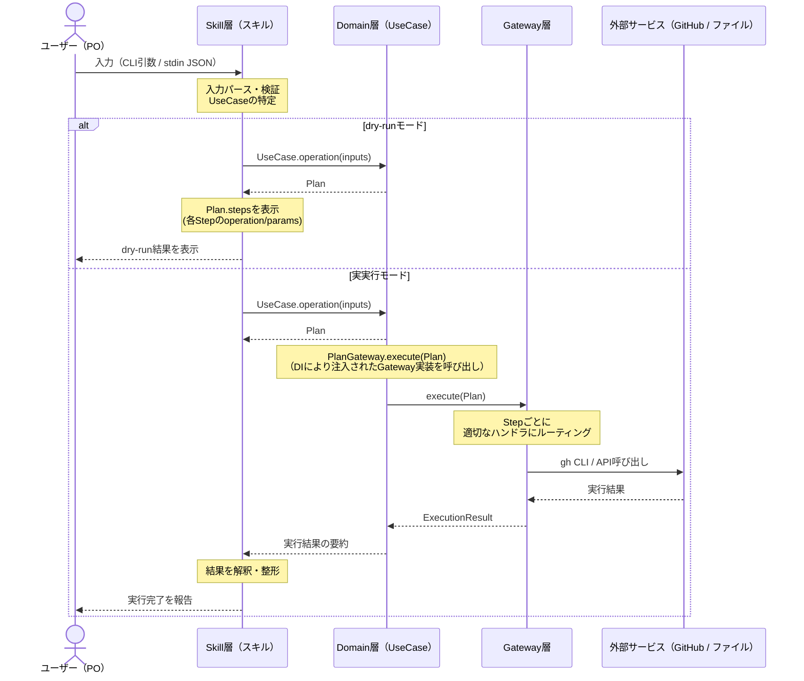

### 4.2. データフロー詳細（表形式）

| 段階            | 層           | 入力                                   | 処理                                                     | 出力                                                    |
| --------------- | ------------ | -------------------------------------- | -------------------------------------------------------- | ------------------------------------------------------- |
| 1. 入力受付     | Skill層      | CLI引数 / stdin JSON                   | 生入力をパースし、呼び出すUseCaseと引数を決定            | UseCaseに渡す型付き引数                                 |
| 2. ビジネス処理 | Domain層     | UseCase引数（Identifier, Statement等） | バリデーション / 状態遷移チェック / 子WP集計等の純粋計算 | `Plan`（実行すべきStepのリスト）                        |
| 3. dry-run分岐  | Skill層      | `Plan`                                 | dry-runフラグを確認                                      | dry-run: Planを表示して終了 / 実実行: PlanをGateway層へ |
| 4. Plan実行     | Gateway層    | `Plan`（Step[]）                       | Step.operationに応じてルーティング                       | 外部サービス呼び出し                                    |
| 5. 外部I/O      | 外部サービス | gh CLI引数 / APIリクエスト             | Issue作成 / Milestone更新 / フィールド更新 / ファイルI/O | API応答 / CLI出力                                       |
| 6. 結果収集     | Gateway層    | 外部サービスからの応答                 | StepResultに変換、部分失敗のハンドリング                 | `ExecutionResult`                                       |
| 7. 結果表示     | Skill層      | `ExecutionResult`                      | 成功/失敗を解釈、ユーザー向けに整形                      | コンソール出力 / エラーメッセージ                       |

### 4.3. 複合操作のデータフロー例

WP完了時に親PBIを自動昇格するケース：

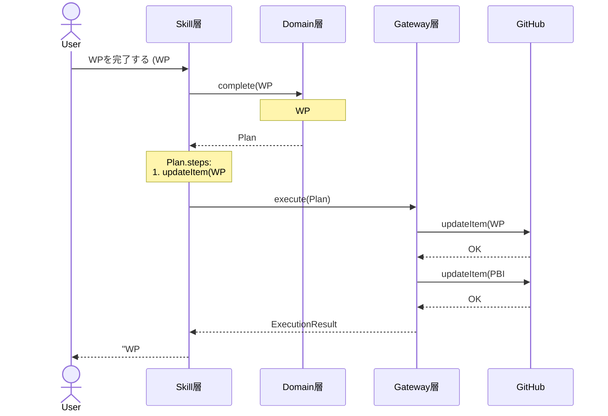

### 4.4. エラー時のデータフロー

各層でのエラー捕捉:

| 層        | エラー種別                                    | 捕捉方法                    | 伝搬先                           |
| --------- | --------------------------------------------- | --------------------------- | -------------------------------- |
| Skill層   | 入力パースエラー、バリデーションエラー        | UseCase呼び出し前に検出     | ユーザーに即時表示               |
| Domain層  | ビジネスルール違反（既完了WPの再着手等）      | UseCase内で例外生成         | Skill層に例外として伝搬          |
| Gateway層 | ネットワークエラー、APIエラー（レート制限等） | StepResult.errorに記録      | ExecutionResultとしてSkill層へ   |
| Skill層   | Gateway層からのエラー                         | ExecutionResult.errorを解釈 | ユーザーにエラーメッセージを表示 |

---

## 第5章: エラー制御と例外フロー

本章では、各層で発生するエラーの種類、捕捉方法、および層を跨いだ伝搬ルールを定義する。

### 5.1. エラー種別と型階層

```typescript
// Domain層が定義するエラー型（Gateway層の技術エラーをDomain用語に変換）
interface DomainError {
  readonly code: DomainErrorCode;
  readonly message: string;
  readonly details?: unknown;
}

type DomainErrorCode =
  // ---- 入力バリデーション ----
  | "INVALID_INPUT" // 入力値の形式が不正
  | "MISSING_REQUIRED_FIELD" // 必須フィールド欠落
  // ---- 状態遷移違反 ----
  | "INVALID_STATE_TRANSITION" // 許容されない状態遷移（例: Done→InProgress）
  | "ALREADY_COMPLETED" // 既に完了している操作の再実行
  | "ALREADY_ARCHIVED" // 既にアーカイブ済み
  // ---- 依存関係違反 ----
  | "PARENT_NOT_FOUND" // 親PBIが存在しないWPの定義
  | "CHILD_WPS_REMAINING" // 子WPが残っているPBIの完了
  | "DUPLICATE_AC_NUMBER" // 重複したAC番号
  // ---- システム ----
  | "UNEXPECTED"; // 予期しないエラー
```

### 5.2. 層別エラー処理ルール

#### Skill層

Skill層はユーザー入力の即時検証と、下位層からのエラーのユーザー向け変換を担当する。

| 発生源                      | エラー種別                                | 処理                                               |
| --------------------------- | ----------------------------------------- | -------------------------------------------------- |
| ユーザー入力（CLI / stdin） | JSONパース失敗、必須項目欠落              | 即座にエラーメッセージを表示し、処理を中断         |
| Domain層からの例外          | `DomainError`（コード + メッセージ）      | コードに応じた日本語エラーメッセージに変換して表示 |
| Gateway層からの応答         | `ExecutionResult` 内の `StepResult.error` | 各Stepの成否を解釈し、部分成功を含む結果を報告     |

#### Domain層

Domain層は業務ルール違反を検出し、`DomainError`
としてSkill層に伝搬する。Gateway層の技術エラーには依存しない。

```typescript
// 状態遷移バリデーションの例
function completeWorkPackage(id: WorkPackageIdentifier): Plan {
  const wp = repository.find(id);
  if (wp.status === "Done") {
    throw { code: "ALREADY_COMPLETED", message: "WPは既に完了しています" };
  }
  if (wp.status !== "InProgress") {
    throw { code: "INVALID_STATE_TRANSITION", message: "着手前のWPは完了できません" };
  }
  // ... Plan生成
}
```

#### Gateway層

Gateway層は外部サービスとの通信エラーを捕捉し、`StepResult`
としてPlanの呼び出し元（Skill層）に返す。Domain層のエラー型には依存しない。

| エラー種別         | 検出方法                               | StepResultへの変換                                  |
| ------------------ | -------------------------------------- | --------------------------------------------------- |
| ネットワークエラー | gh CLIの終了コード != 0 / タイムアウト | `{ success: false, error: "接続失敗" }`             |
| APIエラー          | gh CLIのstderr出力                     | `{ success: false, error: stderrの内容 }`           |
| レート制限超過     | HTTP 429 / gh CLIのエラーメッセージ    | `{ success: false, error: "API制限超過" }`          |
| 項目不存在         | gh CLIの "no issue found" 等           | `{ success: false, error: "項目が見つかりません" }` |

### 5.3. 部分失敗のハンドリング

複数のStepから成るPlanは、一部のStepが失敗しても後続のStepを継続実行する場合と、即座に中断する場合がある。

| 方針                   | 適用条件                                      | 動作                                                               |
| ---------------------- | --------------------------------------------- | ------------------------------------------------------------------ |
| **継続**（デフォルト） | 独立したStep（例: 複数のWP同時作成）          | 失敗Stepのみ `StepResult.error` を記録し、後続Stepを続行           |
| **中断**               | 依存関係のあるStep（例: 親PBI作成後のWP作成） | 失敗を検知した時点でPlan全体を中断、未実行Stepは未実行としてマーク |

### 5.4. エラーの伝搬パターン図

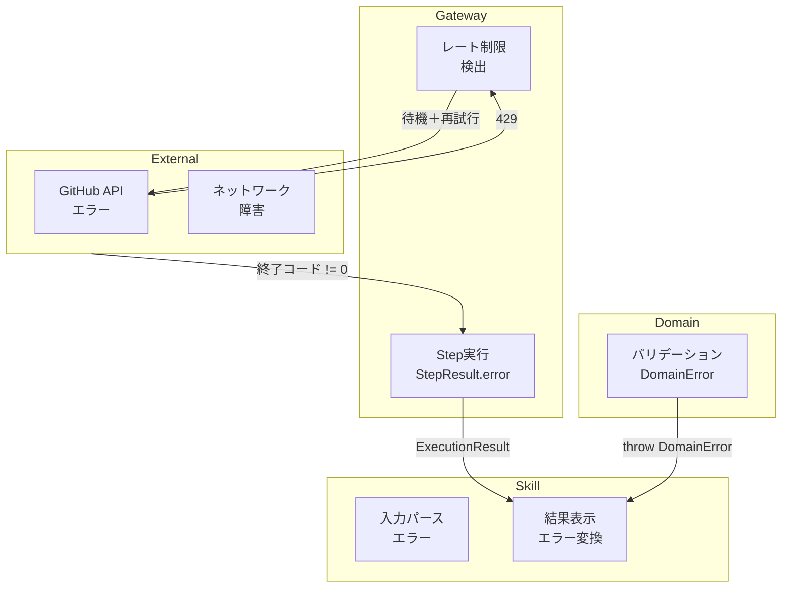

### 5.5. プロセス分析の生成フロー

`ProcessAnalysis`（計画レビュー、実行レビュー、改善提案）はAIの推論を必要とするため、Domain層ではなく
**Skill層** が生成する。

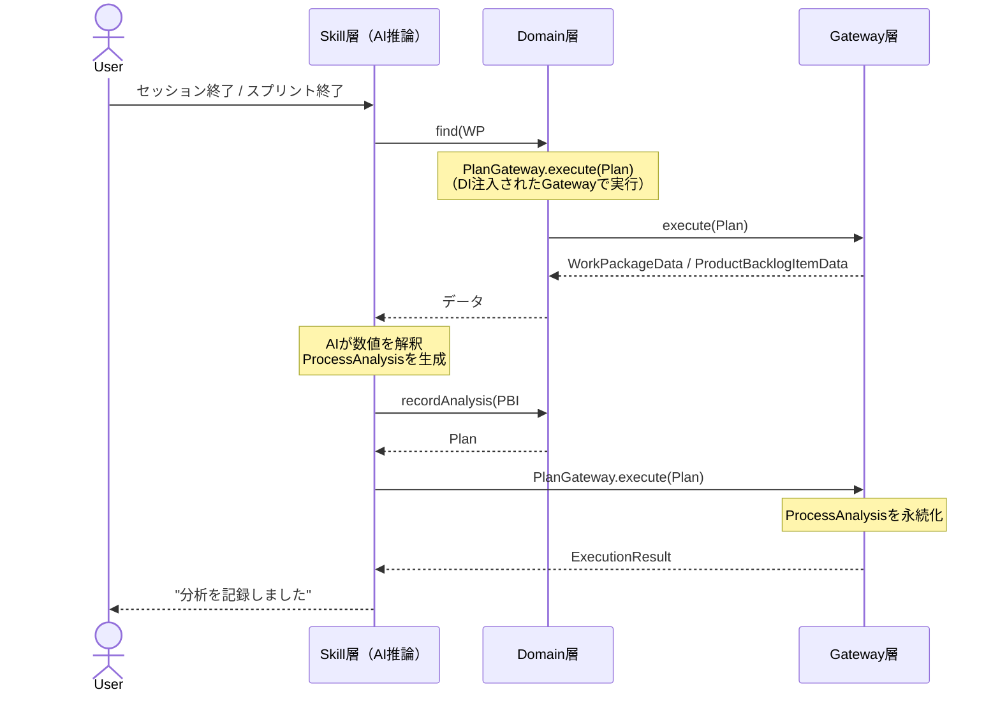

Domain層は `recordAnalysis` で受け取った `ProcessAnalysis`
をそのまま永続化するのみで、内容の解釈は行わない。

本章では、全スキルに共通するdry-runの動作仕様と、変更操作・読み取り操作における分岐の扱いを定義する。

### 6.1. 設計思想

dry-runの目的は「実際に外部APIを呼び出さずに、操作の結果を事前に確認できること」である。以下の2種類の操作に対して統一的な仕組みを提供する。

| 操作種別                                        | dry-run時の表示内容              | 表示元                                  |
| ----------------------------------------------- | -------------------------------- | --------------------------------------- |
| 変更操作（propose, commit, revise, complete等） | `Plan` の内容（summary + steps） | Domain層が生成したPlanをそのまま表示    |
| 読み取り操作（find, search）                    | 入力型の `describe()` が返すPlan | Identifier / SearchCondition が自己記述 |

### 6.2. 変更操作のdry-run

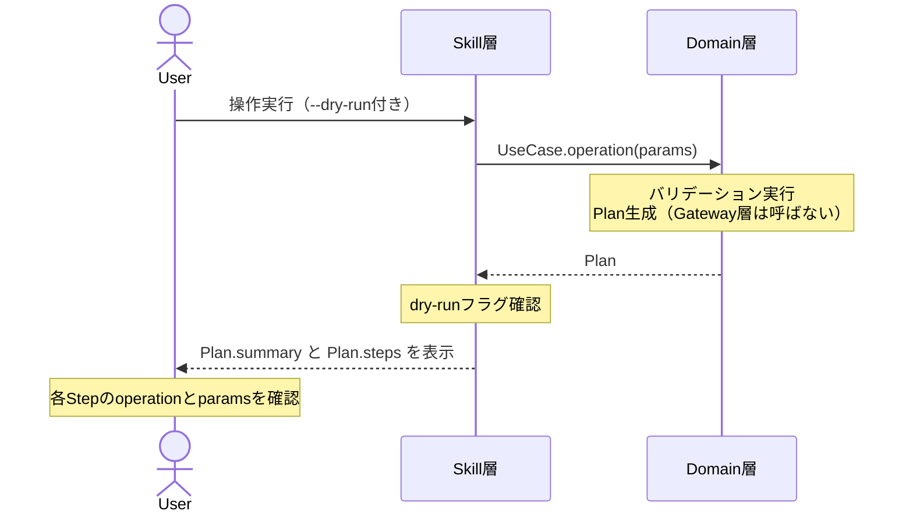

変更操作は常に `Plan` を返す。Skill層は dry-run フラグが立っている場合、`PlanGateway.execute()`
を呼ばずにPlanの内容を表示して終了する。Planが空（stepsが0）の場合は「変更なし」と表示する。

```typescript
// Skill層の処理（概念）
function handleOperation(context, params) {
  const useCase = resolveUseCase(context.operation);
  const plan = useCase.execute(params);

  if (context.dryRun) {
    displayDryRunResult(plan); // Planを表示して終了
    return;
  }

  const result = planGateway.execute(plan); // 実実行
  displayExecutionResult(result);
}
```

### 6.3. 読み取り操作のdry-run

読み取り操作はデータを返すためPlanは不要である。代わりに入力型が自身の `describe()`
メソッドで「何をするか」をPlanとして返す。

```typescript
// Identifier.describe() の例
const epicId: EpicIdentifier = {
  repository: { owner: "my-org", name: "my-repo" },
  title: { value: "認証機能" },
  describe(): Plan {
    return {
      summary: `Epic「${this.title.value}」を取得`,
      steps: [{ operation: "findItem", params: { itemId: `epic-${this.title.value}` } }],
    };
  },
};

// SearchCondition.describe() の例
const condition: EpicSearchCondition = {
  keyword: "認証",
  describe(): Plan {
    return {
      summary: `キーワード「${this.keyword}」でEpicを検索`,
      steps: [{ operation: "searchItems", params: { type: "epic", keyword: this.keyword } }],
    };
  },
};
```

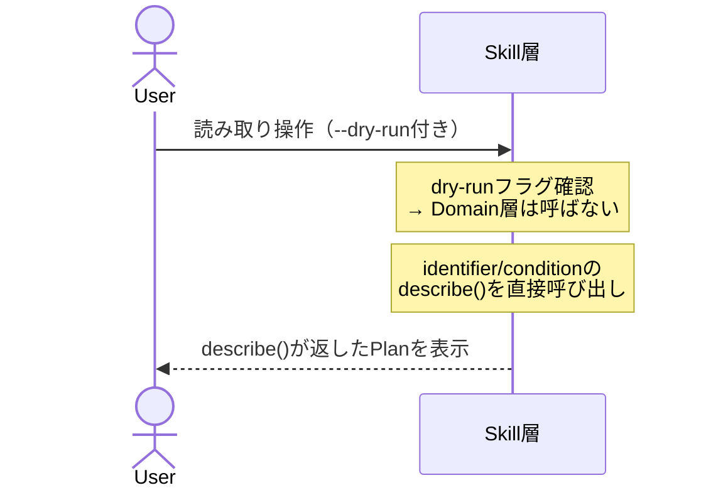

### 6.4. 統一動作仕様

全スキルは以下の統一ルールに従う：

1. **`--dry-run` フラグ**: 全スキルが `--dry-run`
   フラグをCLI引数またはstdinのオプションとして受け付ける
2. **分岐点**:
   dry-runの分岐はSkill層で行う。Domain層はdry-runの有無を意識せず、常に同じ処理（Plan生成／データ取得）を実行する
3. **Gateway層は呼ばれない**: dry-run時は `PlanGateway.execute()`
   は呼ばれない。読み取り操作の場合も、Domain層のメソッドを呼んだ後にデータを破棄し、入力型の
   `describe()` で代替表示する
4. **副作用ゼロ**: dry-runは外部サービスに一切の変更を加えない
5. **一貫した出力形式**: dry-runの出力は常にPlanの形式（`summary` + `steps`）で統一する

| 条件                     | Domain層の動作         | Skill層の動作               | Gateway層の動作    |
| ------------------------ | ---------------------- | --------------------------- | ------------------ |
| 通常実行（変更操作）     | Plan生成               | PlanGateway.execute()を呼ぶ | Stepを実行         |
| dry-run（変更操作）      | Plan生成（通常と同じ） | Planを表示して終了          | 呼ばれない         |
| 通常実行（読み取り操作） | データを返す           | データをユーザーに表示      | データ取得（内部） |
| dry-run（読み取り操作）  | 呼ばれない             | describe()のPlanを表示      | 呼ばれない         |

---

## 第7章: 動的Project ID解決と初期化フロー

本章では、プロジェクト初期化時（`setup-github-projects`）にGitHub Project
V2のIDを動的に解決し、`.harnessrc` に自動設定する仕組みを定義する。

### 7.1. 設計方針

Project ID（GitHub Project V2の数値ID）は従来 `.harnessrc`
にベタ書きされていたが、この方法は環境間の乖離や手動編集ミスの原因となる。本設計では、初期化時に自動検出・作成・書き込みを行うことで、番号管理を完全に自動化する。

| 方式           | 従来                    | 本設計                       |
| -------------- | ----------------------- | ---------------------------- |
| IDの管理方法   | `.harnessrc` にベタ書き | 初期化スクリプトが自動生成   |
| 環境差への対応 | 手動編集が必要          | `gh project list` で自動検出 |
| 未作成時の対応 | 手動作成が必要          | 存在しなければ自動作成       |
| リファレンス   | `.harnessrc` が唯一     | `.harnessrc.example` を残す  |

### 7.2. 動的解決フロー

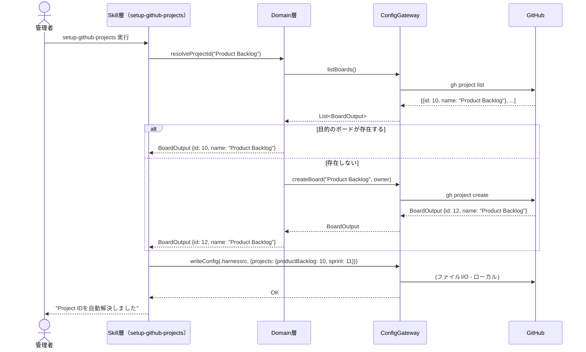

### 7.3. 設定ファイル構造

`.harnessrc`（自動生成）：

```json
{
  "projects": {
    "productBacklog": 10,
    "sprint": 11
  }
}
```

`.harnessrc.example`（手動編集時のリファレンス）：

```json
{
  "projects": {
    "productBacklog": 10,
    "sprint": 11
  },
  "_comment": "このファイルは手動編集時のリファレンスです。通常は setup-github-projects が自動生成します。"
}
```

### 7.4. 自動生成と手動編集の使い分け

| シチュエーション                    | 方法                                                                                       |
| ----------------------------------- | ------------------------------------------------------------------------------------------ |
| 新規プロジェクトの初期セットアップ  | `setup-github-projects` を実行（推奨）                                                     |
| 既存プロジェクトのID再設定          | `setup-github-projects` を再実行                                                           |
| CI/CD環境でのヘッドレスセットアップ | 環境変数からIDを注入 + `setup-github-projects --headless`                                  |
| 手動での微調整                      | `.harnessrc` を直接編集（非推奨だが可能）<br/>変更後は `.harnessrc.example` も更新すること |

---

## 第8章: アーカイブとデータ保持

本章では、PBI / WP / Review / Retrospective
のアーカイブ（Close）時のデータ構造と保持ルールを定義する。

### 8.1. アーカイブの定義

本設計におけるアーカイブは **Issue Close**
として実現する。Close後も以下のデータは保持され、参照可能である。

| データ種別                       | 保持場所          | Close後の状態                 |
| -------------------------------- | ----------------- | ----------------------------- |
| Issue本体（Title, Body, Labels） | GitHub Issues     | Closed（閲覧可能）            |
| Projects V2カスタムフィールド    | Projects V2 Board | 保持（Board上でフィルタ可能） |
| 子WP（sub-issues）               | GitHub Issues     | Closed（親PBIと同時にClose）  |
| コメント・変更履歴               | Issue Comments    | 保持                          |
| マイルストーン                   | Milestone         | 保持                          |

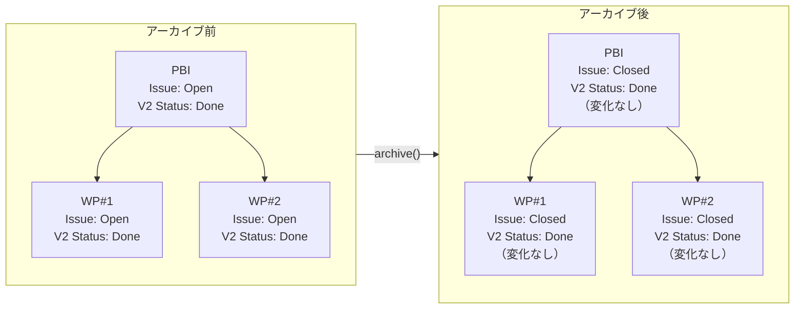

アーカイブ後も全フィールド（Projects
V2カスタムフィールド含む）は保持され、子WPもClosed状態で維持される。

### 8.2. アーカイブ前後のデータ状態

#### PBI

| フィールド                    | アーカイブ前 | アーカイブ後                                                |
| ----------------------------- | ------------ | ----------------------------------------------------------- |
| Issue状態                     | Open         | **Closed**                                                  |
| Title / Body                  | 設定済み     | 変化なし                                                    |
| Projects V2 Status            | Done         | Done（変化なし）                                            |
| Projects V2カスタムフィールド | 設定済み     | **保持**（`harness-size-*`, `harness-efforts-analysis` 等） |
| 子WP                          | 全WPがDone   | 全WPが **Closed**                                           |
| マイルストーン                | 設定済み     | 変化なし                                                    |

#### WP

| フィールド                    | アーカイブ前                       | アーカイブ後                                                 |
| ----------------------------- | ---------------------------------- | ------------------------------------------------------------ |
| Issue状態                     | Done（Open維持）→ スプリント終了時 | **Closed**                                                   |
| Projects V2 Status            | Done                               | Done（変化なし）                                             |
| Projects V2カスタムフィールド | 設定済み                           | **保持**（`harness-efforts-analysis`, `harness-metrics` 等） |
| processEvidence               | 設定済み                           | 変化なし                                                     |
| sessionMetrics                | 設定済み                           | 変化なし                                                     |

#### Review / Retrospective

| フィールド                    | アーカイブ前 | アーカイブ後 |
| ----------------------------- | ------------ | ------------ |
| Issue状態                     | Open         | **Closed**   |
| 本文（レビュー結果 / KPT）    | 記入済み     | 変化なし     |
| Projects V2カスタムフィールド | 設定済み     | **保持**     |

### 8.3. アーカイブタイミング

| 概念          | アーカイブのトリガー          | 実行主体                  |
| ------------- | ----------------------------- | ------------------------- |
| PBI           | スプリントレビュー + PO承認後 | `sprint-end` ワークフロー |
| WP            | 親PBIのアーカイブと同時       | 親PBIのarchive()に連動    |
| Review        | スプリント終了時              | `sprint-end` ワークフロー |
| Retrospective | 振り返り完了後                | `sprint-end` ワークフロー |

### 8.4. データ移行時の考慮点

既存システムからの移行時は別途 `migrate-to-github`
スキルを使用する（第9章で定義）。新規運用ではアーカイブ = Close
の単純な操作で完結し、データ構造の変換は一切発生しない。

---

## 第9章: 移行設計

本章では、既存のローカルMarkdown管理からGitHub Issue / Projects
V2への移行方式を定義する。新規運用では不要な設計である。

### 9.1. 基本原則: 一件単位の移行

移行は **1PBI単位** を基本とする。複数PBIの移行も、単一PBI移行処理のループで実現する。

```typescript
// 移行の基本ループ（概念）
async function migrateAll(context): Promise<MigrationResult> {
  const pbis = loadLocalBacklog(); // ローカルのproduct-backlog.md を読み込み
  const results: MigrationResult[] = [];

  for (const pbi of pbis) {
    try {
      const plan = domain.migratePbi(pbi); // Domain層がPBIごとにPlanを生成
      const result = await planGateway.execute(plan);
      results.push({ pbi: pbi.id, success: true });
    } catch (e) {
      results.push({ pbi: pbi.id, success: false, error: e });
    }
  }

  return aggregateResults(results);
}
```

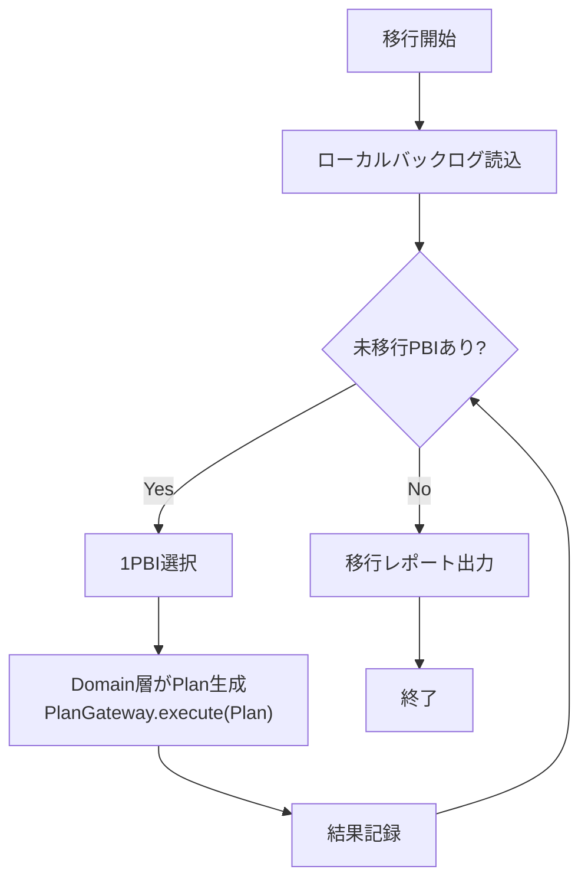

### 9.2. 1PBIの移行で生成されるPlan

1PBIの移行は以下のStepから構成される：

| Step | operation        | 内容                                                        |
| ---- | ---------------- | ----------------------------------------------------------- |
| 1    | `createItem`     | PBIのIssueを作成（Title, Body, Labels, Milestone）          |
| 2    | `updateItem`     | PBIのProjects V2フィールドを設定（Status, size-estimate等） |
| 3    | `createItem` × N | 子WPのIssueを順次作成                                       |
| 4    | `updateItem` × N | 各WPのProjects V2フィールドを設定（Status, effort等）       |

```typescript
// 1PBIの移行Planの例
{
  summary: "PBI「認証機能」を移行（WP3件）",
  steps: [
    { operation: "createItem", params: { title: "認証機能", type: "PBI", milestone: "Sprint 10" } },
    { operation: "updateItem", params: { status: "Done", sizeEstimate: "M" } },
    { operation: "createItem", params: { title: "ログイン画面", parentPbi: "pbi-5", type: "WP" } },
    { operation: "updateItem", params: { status: "Done", effortInitial: 2, effortActual: 3 } },
    // ... 残りのWP
  ]
}
```

### 9.3. レート制限対策

GitHub APIのレート制限（5000 req/h）を考慮し、移行処理は以下の対策を実装する。

#### 事前確認

移行開始前に現在のレート制限残数を確認し、移行可能な量を見積もる。

```
gh api rate_limit → { resources: { core: { remaining: 4800, reset: 1719000000 } } }
```

#### 中断検出と再開

| 状況                       | 検出方法                         | 対処                                              |
| -------------------------- | -------------------------------- | ------------------------------------------------- |
| レート制限超過             | API応答の429またはgh CLIのエラー | `Retry-After` ヘッダー分待機して再試行（最大3回） |
| ネットワーク切断           | gh CLIの終了コード != 0          | `StepResult.error` に記録し、後続PBIへ続行        |
| 途中中断（ユーザー割込み） | Ctrl+C / プロセス終了            | 次回起動時に完了済みPBIをスキップ                 |

#### 再開時のスキップロジック

```typescript
async function migrateWithResume(context): Promise<void> {
  const completed = loadMigrationLog(); // 前回完了したPBI ID一覧
  const pbis = loadLocalBacklog().filter((pbi) => !completed.includes(pbi.id));

  for (const pbi of pbis) {
    await migrateSinglePbi(pbi);
    appendMigrationLog(pbi.id); // 1件完了ごとにログ追記
  }
}
```

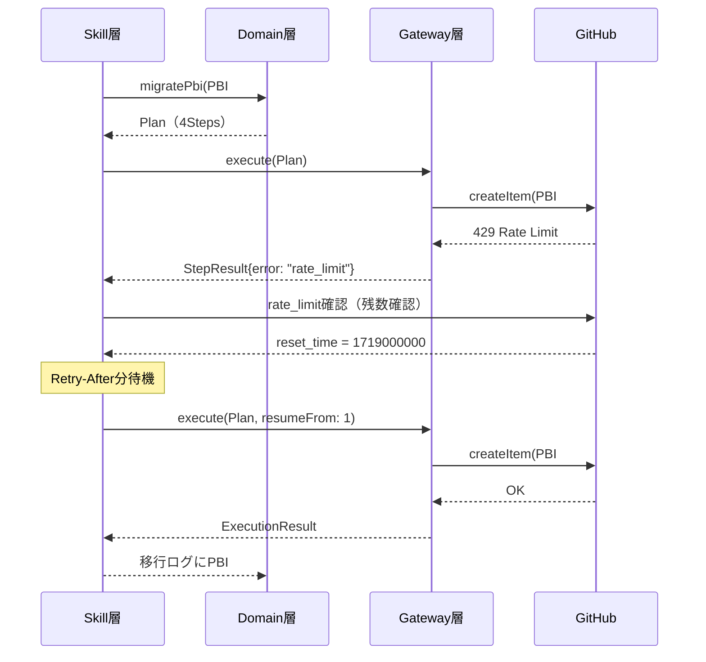

### 9.4. 移行レポート

全PBIの移行完了後、以下のレポートを出力する：

| 指標               | 説明                                  |
| ------------------ | ------------------------------------- |
| 総PBI数            | 移行対象のPBI総数                     |
| 成功件数           | 移行に成功したPBI数                   |
| 失敗件数           | 移行に失敗したPBI数（エラー理由付き） |
| スキップ件数       | 既に移行済みとしてスキップしたPBI数   |
| 総API呼び出し回数  | 移行中に行ったAPI呼び出しの合計       |
| レート制限到達回数 | レート制限で一時停止した回数          |
