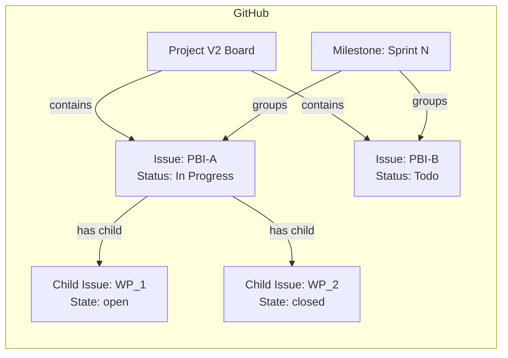

# GitHub Operations Guide

本ドキュメントは、Global Harness Manager
の3層ライフサイクル（プロジェクト層・スプリント層・セッション層）が GitHub Issues/Projects V2
上でどのように表現され、各ワークフローの実行時に何が自動的に作成・更新されるかを説明します。

---

## 1. 3層モデルとGitHub上の表現

### 1.1. プロジェクト層 (Project Layer)

| 概念                                    | GitHub上の表現                                                         | 作成タイミング                                          |
| --------------------------------------- | ---------------------------------------------------------------------- | ------------------------------------------------------- |
| プロジェクトビジョン / プロダクトゴール | GitHub Issue（`type:Vision` ラベル）/ `product-backlog.md` で管理      | `establish-vision` / `define-product-goal` スキル実行時 |
| Epic / Feature（大規模PBI）             | Issue（`type:epic` / `type:feature` ラベル） + Project V2 の階層ビュー | バックログリファインメント時                            |
| リリース管理                            | Milestone（プロジェクト全体の区切り）                                  | 必要に応じて手動作成                                    |

### 1.2. スプリント層 (Sprint Layer)

| 概念                          | GitHub上の表現                                     | 作成タイミング                                 |
| ----------------------------- | -------------------------------------------------- | ---------------------------------------------- |
| スプリント                    | Milestone（`Sprint N`）                            | `/sprint-start` の `github-sprint-init` スキル |
| スプリントにコミットされたPBI | Issue（`type:PBI` ラベル） + Milestone に紐付け    | `/sprint-start` の `github-pbi-commit` スキル  |
| PBIの状態管理                 | Project V2 内蔵Status（Todo / In Progress / Done） | 各ワークフローで自動更新                       |
| PBIのアーカイブ               | DONEのPBI Issue を Close（`github-pbi-archive`）   | `/sprint-end` 実行時                           |
| スプリントレビュー結果        | Issueコメント / Project V2 のカスタムフィールド    | `/sprint-end` 実行時                           |

### 1.3. セッション層 (Session Layer)

| 概念           | GitHub上の表現                            | 作成タイミング                                |
| -------------- | ----------------------------------------- | --------------------------------------------- |
| Work Package   | 子Issue（sub-issue, `type:wp` ラベル）    | セッション開始時に通知                        |
| セッション計画 | Issue body 内の AC チェックリスト         | `/session-start` の `session-planning` スキル |
| 実装進捗       | 子Issueの Open/Close 状態                 | `/develop-work-package` でのAC完了時          |
| セッション成果 | Issueコメント + Project V2 フィールド更新 | `/session-end` の `github-pbi-update` 等      |

---

## 2. ワークフロー別 GitHub 操作フロー

### 2.1. `/sprint-start`

1. **`github-sprint-init`**: 新規 Milestone `Sprint N` を作成する
2. **`github-pbi-search`**: 将来のバックログから対象PBIを検索する
3. **`github-pbi-update`**: 選択されたPBIの Milestone を Sprint N に設定する
4. **`github-pbi-commit`**: PBIのステータスを `todo` に設定する

### 2.2. `/session-start`

1. **`github-wp-search`**: 親PBIに紐づく未完了WPを検索する
2. 該当WPの Issue に実装計画（ACリスト）をコメント追記する
3. PBI Issue の Status を `In Progress` に更新する

### 2.3. `/develop-work-package`

1. AC完了に応じて子Issueを Close する
2. PBI Issue の body 内 AC チェックボックスを更新する
3. WIPコミットとして進捗を保存する（GitHub上ではコミットとして記録）

### 2.4. `/session-end`

1. **`github-wp-update`**: 該当WPの子Issueステータスを更新する
2. **`github-pbi-update`**: PBI Issue の Status フィールドを反映する
3. セッションメトリクスを Issue コメントとして記録する

### 2.5. `/sprint-end`

1. **`github-sprint-review-plan`**: Sprint N の全PBI一覧を取得する
2. **`github-pbi-archive`**: DONEのPBI Issue を Close する
3. **`github-sprint-velocity-record`**: ベロシティ情報を記録する

---

## 3. Projects V2 ボードの活用

Projects V2 では、以下のフィールドを活用して状態管理を行います。

### 3.1. 標準フィールド

| フィールド | 説明                            | 値の例                                   |
| ---------- | ------------------------------- | ---------------------------------------- |
| Title      | Issueのタイトル（PBI名を入力）  | `PBI-Name`                               |
| Status     | PBIの進捗状態（Project V2内蔵） | `Backlog`, `Todo`, `In Progress`, `Done` |
| Milestone  | 所属スプリント                  | `Sprint 12`                              |
| Assignees  | 担当者                          | （任意）                                 |
| Labels     | 種別ラベルのみ                  | `type:PBI`                               |

### 3.2. 状態遷移とビューの活用

Project V2 ボードでは、**Status フィールド**
を軸に以下のビューを設定することで、一覧で状態を俯瞰できます：

| ビュー名             | フィルタ条件                                                          | 活用シーン                    |
| -------------------- | --------------------------------------------------------------------- | ----------------------------- |
| スプリントバックログ | Milestone = `Sprint N`, Status != `Done`                              | スプリント中に対象のPBI一覧   |
| 未着手候補           | Status = `Backlog`                                                    | 将来のスプリントで検討するPBI |
| 未着手（コミット済） | Status = `Todo`                                                       | 次の着手候補の選定            |
| 進行中PBI            | Status = `In Progress`                                                | 日次の進捗確認・滞りの発見    |
| 完了PBI              | Status = `Done`                                                       | スプリント終了時の成果確認    |
| 種別別               | Labels contains `type:epic` / `type:feature` / `type:PBI` / `type:wp` | 階層構造の把握                |
| サイズ別             | `harness-size-estimate` = XS / S / M / L / XL（Project V2フィールド） | 負荷分散の確認                |

**具体的な運用イメージ**:

1. **バックログリファインメント**:
   「未着手候補（Backlog）」ビューでPBIの優先順位を整理し、スプリント計画の準備をします。
2. **スプリント開始時**: 「未着手候補」から今回のスプリントで実施するPBIの Status を `Todo`
   に変更し、POとコミット範囲を確定します。
3. **セッション開始時**: 該当PBIの Status を手動で `In Progress`
   に変更し、着手を可視化します（将来のワークフロー自動化対象）。
4. **日次確認**: 「進行中PBI」ビューで長期間 `In Progress`
   のままのPBIを特定し、POに状況を報告します。
5. **スプリント終了時**:
   「完了PBI」ビューで今スプリントの成果を一覧し、未完了PBIは次スプリントに繰り越し判断します。

**運用のポイント**:

- PBI Issue の Status は原則として手動操作不要（ワークフロー内で自動更新）。
- 各 Issue に紐づく子Issue（WP）の状態は、親Issueのコメント欄または sub-issues
  ツリーで確認できます。
- クロスプロジェクトで Projects V2 を利用する場合は、各 Issue の `repo`
  フィールドで所属リポジトリを識別します。
- ビューは「保存」することでチームメンバー間で共有可能です。

---

## 4. 状態遷移図



### 4.1. PBI の状態遷移

```
Backlog (未着手候補) --> Todo (スプリントコミット済) --> In Progress (開発中) --> Done (完了)
```

- **Backlog**: 将来のスプリントで実施を検討するPBI。Project V2 上で薄灰色表示。
- **Todo**: スプリント計画で実施すると決定し、コミットされたPBI。Project V2 上で灰色表示。
- **In Progress**: 現在開発中のPBI。Project V2 上で青色表示。子Issueの進捗で進行度を確認。
- **Done**: 全ACが完了しPO承認を得たPBI。Project V2 上で緑色表示。スプリント終了時に Close。

**Note**: 従来のカスタムフィールド `harness-status`（IDEA/TODO/WIP/DONE）は削除された。Project V2
内蔵Status（Backlog/Todo/In Progress/Done）を使用する。スプリント未計画のPBIは `Backlog`
のまま維持される。

## 5. トラブルシューティング

### 5.1. gh CLI 認証エラー

**症状**: `gh auth status` で `not logged in`、またはスキル実行時に認証エラー。

**原因と対処**:

| 原因                      | 対処                                        |
| ------------------------- | ------------------------------------------- |
| 未ログイン                | `gh auth login` でブラウザ認証を実行        |
| アカウント間違い          | `gh auth switch` で正しいアカウントに切替   |
| トークン期限切れ          | `gh auth refresh` でトークンを再発行        |
| SSH ではなく HTTPS を使用 | `gh auth setup-git` で Git プロトコルを設定 |

### 5.2. ラベル不整合

**症状**: Issue 作成時に期待したラベルが付与されない、または重複して付与される。

**原因と対処**:

- **ラベル未作成**: `setup-github-labels` スキルを実行して標準ラベルを一括作成します。
- **ラベル名のタイポ**: ラベル名は完全一致で指定します（例: `type:PBI`）。size関連は Project V2
  カスタムフィールド（`harness-size-estimate`）で管理する。
- **リポジトリ間の差異**: 各リポジトリに同じラベルセットが存在することを確認します。

### 5.3. Project Item と Issue の紐付け失敗

**症状**: Issue を作成したが Project V2 ボードに表示されない。

**原因と対処**:

- **Project に Issue が追加されていない**: `addToProject` が正しく実行されているか確認します。
- **Project のフィールド定義と Issue のラベル不一致**: Project V2 のカスタムフィールド定義と Issue
  の Labels を突合します。
- **クロスリポジトリ制約**: 異なるリポジトリの Issue を Project に追加する場合、Project が
  Organization レベルで作成されている必要があります。

### 5.4. Milestone 作成エラー

**症状**: `github-sprint-init` で Milestone 作成に失敗する。

**原因と対処**:

- **同名 Milestone が既存**: スプリント番号が重複していないか確認します。
- **権限不足**: リポジトリへの書き込み権限があるか確認します。

### 5.5. 子Issue（sub-issue）関連の注意点

- **sub-issues はパブリックベータ機能**です。GitHub の機能更新により挙動が変わる可能性があります。
- 子Issue の作成に失敗した場合、代わりに Issue body 内に `parent: #N`
  形式で親子関係を記述するフォールバックが使用されます。
- 子Issue の一覧は親Issue ページの "Sub-issues" タブで確認できます（GitHub UI）。
