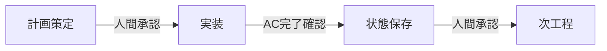

# Operations Guide

本ドキュメントは、Global Harness Manager
が提唱する3階層スコープモデルと、その運用フレームワークを解説する **L1（運用ガイド）**
です。コードの詳細や属性の定義は L2（設計仕様）、API 設計やデータフローは
L3（アーキテクチャ設計）に委ねます。

---

## 第1章: AI協働開発に構造化されたプロセス管理が不可欠な理由

### 1.1. AI協働開発が直面する3つの課題

**コンテキスト汚染とアテンション限界** AI
は一度に扱える文脈量（コンテキストウィンドウ）に制約があります。一つの会話が長くなり内容が増えるほど、過去の決定や前提が正確に保持されず、品質が劣化します。そのため「一つの作業を完結させたら会話をリセットする」という単位での分割が不可欠です。

**再現性の欠如** AI
の出力は確率的であり、同じ指示を出しても同じ結果が得られるとは限りません。どのような方針で、どのような判断を経て、どのような成果物が生まれたか——その「プロセス」を構造的に記録しなければ、後からの検証や再利用が困難です。

**チームでの協調** 一人の開発者が複数の AI
セッションを並行して走らせる場合や、複数の人間が同じプロジェクトに関わる場合、個々の作業の状態や成果を共有する仕組みがなければ全体の進捗が迷宮入りします。

### 1.2. 本プロジェクトが提供する「管理の型」

上記の課題に対して、本プロジェクトは「作業をどの粒度で分割し」「どの単位でゴールを設定し」「どのように状態を記録・共有するか」という**管理の型（＝3階層スコープモデル）**
をあらかじめ定義し、それをプロジェクトに物理的に組み込める形で提供します。

このリポジトリをクローンし、オンボーディングを実行するだけで、役割定義・ワークフロー・品質ガードレールが即座に利用可能になります。ユーザーはインフラやプロセスの構築に迷うことなく、再現性の高い
AI 協働開発を開始できます。

---

## 第2章: 本プロジェクトが提唱する3階層スコープモデル

3階層スコープモデルは、上位層が下位層の方向性を定義する階層構造です。プロジェクト層が長期的な方向性を示し、スプリント層がその方向性に沿った具体的なゴールを設定し、セッション層がゴールを達成するための作業を実行します。

```
┌────────────────────────────────────────────────┐
│  プロジェクト層                                 │
│  Vision / Product Goal / Epic / Feature         │
│  ┌─ 目的階層: Vision → Product Goal            │
│  └─ 分類階層: Epic → Feature                   │
├────────────────────────────────────────────────┤
│  スプリント層                                   │
│  Sprint Goal / PBI / Review / Retrospective        │
│  （目的階層: Product Goal → Sprint Goal → PBI）│
├────────────────────────────────────────────────┤
│  セッション層                                   │
│  Work Package (WP)                              │
│  （目的階層: PBI → WP）                         │
└────────────────────────────────────────────────┘
```

以下、各層を上位から順に説明します。

### 2.1. プロジェクト層——長期的な方向性を定義する概念群

プロジェクト層は、プロジェクトが中長期的に目指すべき方向性を定義します。この層の概念は頻繁には変更されず、長期間にわたって判断基準として機能します。

**Vision（ビジョン）**: プロジェクトが中長期的に目指す理念（North
Star）です。全ての判断基準の根幹となります。

**Product Goal（プロダクトゴール）**:
ビジョン達成に向けて、現在取り組むべき具体的な到達目標です。このゴールを達成するために、以下のスプリント層で
Sprint Goal が設定されます。

**Epic（エピック）**: 複数の PBI
を束ねる大規模な機能領域です。プロジェクトがある程度の規模になると、PBI
だけでは管理が粗すぎる場合に導入します。

**Feature（フィーチャー）**: Epic に属する機能単位です。Epic をさらに細分化したい場合に導入します。

### 2.2. スプリント層——具体的なゴールを設定する概念群

スプリント層は、プロジェクト層が示した方向性に対して、短期間で達成すべき具体的なゴールを定義します。このゴールに向けて、以下のセッション層で個別の作業が実行されます。

**Sprint Goal**: 各スプリントで達成すべき短期的な目標です。Product Goal から導かれ、選択した PBI
群の存在理由を明確にします。

**PBI（Product Backlog Item）**: Sprint Goal を達成するために必要な価値の最小単位です。PBI
には完了の基準（Acceptance Criteria、受入基準、AC）が定義され、その達成を検証するために後述の WP
が用いられます。1つの PBI は複数の WP に分解され、全ての WP が AC を満たして完了することで PBI
も完了します。

**Review**: スプリント終了時に、Sprint Goal に対する達成状況を PO が検証・承認するための概念です。

**Retrospective**:
スプリント開始時に枠が作成され、スプリント終了後にプロセスや協働の質を振り返り（KPT）、次スプリントへの改善策を記録する概念です。Retrospective
が完了するまでスプリントは終了できません。

### 2.3. セッション層——ゴールを作業に分解して実行する層

セッション層は、スプリント層で定義された PBI を作業可能な単位に分解し、AI
との1回の対話で完結する形で実行します。この層の目的は、上位層で定義されたゴールを具体的なアウトプットに変換することです。

**Work Package（WP）**: PBI を分解した最小の実装単位です。1セッションで1つの WP
を完了させることを原則とします。WP は親となる PBI に紐付けられます。

### 2.4. 層間の関係——二つの階層構造

3階層スコープモデルには、**目的の階層**と**分類の階層**という二つの異なる観点の階層が存在します。

**目的の階層（Whyの観点）**:

```
Vision → Product Goal → Sprint Goal → PBI → WP
```

上位の概念が下位の概念の「存在理由」を定義します。Vision が Product Goal を導き、Product Goal が
Sprint Goal を導き、Sprint Goal が PBI を導き、PBI が WP
を導きます。この連鎖により、すべての作業がプロジェクトのビジョンに紐付きます。

**分類の階層（Whatの観点）**:

```
Epic → Feature → PBI
```

大規模なプロジェクトで PBI の数が増えた場合に、それらを意味的にグループ化するための階層です。Epic や
Feature に属する PBI
は、必ずしも同じスプリントで完了するとは限らず、複数スプリントにわたることがあります。

PBI は両方の階層に同時に属します——ある Sprint Goal を達成するために存在し、同時に Epic/Feature
の一部として分類されます。状態遷移の詳細なルールは L2（設計仕様）で定義します。

---

## 第3章: 3階層スコープモデルの運用フレームワーク

第2章で定義した3階層スコープモデルを、実際の開発現場で運用するためのフレームワークを定義します。

### 3.1. ワークフローとスキルの階層

運用フレームワークは、**ワークフロー**と**スキル**の二階層で構成されます。

**ワークフロー**は上位の概念であり、複数のスキルを適切な順序で呼び出して一連のプロセスを完結させます。ワークフローは各スキルの役割を熟知しており、目的に応じて必要なスキルを選択・実行します。

**スキル**は下位の概念であり、3階層スコープモデルの各概念（PBI、WP、Review、Retrospective
等）に対する単一の操作を担当します。スキルは自身が呼び出し元（ワークフロー）を意識することなく、与えられた役割を実行します。

```
ワークフロー（sprint-start / session-start 等）
    └── スキル（PBIの作成、WPの状態変更、Reviewの作成 等）
            └── 3階層スコープモデルの各概念
```

人間は個々のスキルを直接呼び出すのではなく、ワークフローに対して「スプリントを開始して」「このセッションを計画して」と指示するだけで、一連のプロセスが自動的に進行します。

### 3.2. AIに指示する操作一覧

本フレームワークでは、以下のワークフローを AI
に指示することができます。人間は意思決定と価値基準に責任を持ち、AI
は情報取得・表示・プログラミングの実行に責任を持ちます。

| 指示            | 責任主体                                      | 概要                                                                                              | 実行タイミング                   |
| --------------- | --------------------------------------------- | ------------------------------------------------------------------------------------------------- | -------------------------------- |
| `project-setup` | AI主導／各段階で人間確認                      | AI 実行基盤の構築、各種ボード・ラベル・ブランチ保護ルールの設定                                   | プロジェクト初期化時（初回のみ） |
| `kickoff`       | 人間主導（意思決定）／AI支援（記録）          | プロジェクトの情熱検証、ビジョン策定、技術選定を段階的に実行。Vision／Product Goal 等が作成される | プロジェクト開始時               |
| `sprint-start`  | 人間主導（PBI選択・AC定義）／AI実行           | バックログリファインメント、AC定義、スプリント計画、タイムボックス作成とPBIの状態更新             | 各スプリント開始時               |
| `sprint-end`    | 人間主導（レビュー判断・KPT）／AI実行（記録） | スプリントレビュー、Done PBI のアーカイブ、ベロシティ記録、予実評価、KPT                          | 各スプリント終了時               |
| `session-start` | AI主導／各段階で人間承認                      | ビジョンと能力の同期、WP特定、実装計画策定。WP が作成され、進捗状態が更新される                   | 各セッション開始時               |
| `session-end`   | AI主導（要約・記録）                          | セッション成果の要約、KPT、メトリクス記録。WP の進捗状態が更新される                              | 各セッション終了時               |

### 3.3. 進捗管理のルール——状態と単方向遷移

各発行物の進捗は状態によって管理します。使用する状態の組み合わせは発行物の種類によって異なります。

**PBI の状態**: PBI は発案から完了までの4状態を遷移します。

| 状態           | 意味                                                                                        | 設定されるタイミング                 | 次に遷移可能な状態 |
| -------------- | ------------------------------------------------------------------------------------------- | ------------------------------------ | ------------------ |
| **Idea**       | 発案段階。着手前の初期状態                                                                  | PBI 作成時                           | Idea → Todo        |
| **Todo**       | スプリントバックログにコミットされ、AC が定義され、それを実現するための WP が作成された状態 | スプリント計画時                     | Todo → InProgress  |
| **InProgress** | PBI のいずれかの WP が InProgress または Done になった状態                                  | 最初の WP が InProgress に遷移した時 | InProgress → Done  |
| **Done**       | 全子 WP が完了し、PBI の AC が全て達成された状態                                            | 全子 WP 完了時／PO 承認時            | Done が終端        |

**WP の状態**: WP はスプリント計画時に PBI の AC を実現するために作成されるため、作成された時点で
Todo であることが自明です。

| 状態           | 意味                                            | 設定されるタイミング    | 次に遷移可能な状態 |
| -------------- | ----------------------------------------------- | ----------------------- | ------------------ |
| **Todo**       | 未着手の状態                                    | WP 作成時（デフォルト） | Todo → InProgress  |
| **InProgress** | セッション計画が承認され、実装中の状態          | セッション計画承認時    | InProgress → Done  |
| **Done**       | セッション作業が完了し、PO の承認が得られた状態 | PO 承認時               | Done が終端        |

状態は原則として単方向（Idea → Todo → InProgress → Done）で遷移します。

### 3.4. 品質ガードレール

品質ガードレールは、AI
が自律的に行動する中で意図しないデータ更新や計画の逸脱が発生するのを防ぐための一連の仕組みです。以下の要件を満たすように設計されています。

**計画先行の原則**: AI
は作業を開始する前に、何を・なぜ・どのように行うかを明文化した計画を作成し、人間の承認を得なければなりません。計画のない実装は禁止されます。

**チェックポイント進行**: 作業は Acceptance
Criteria（AC、受入基準）単位のチェックポイントで進行します。各チェックポイントには明確な完了条件が定義され、条件を満たさなければ次の工程に進めません。

**状態の永続化**:
各チェックポイントが完了するたびに、その時点の作業状態が保存されます。これにより、万が一会話のコンテキストが失われても、どこまで作業が完了したかを追跡でき、再開が可能になります。

**構造の強制**: 全ての作業は決められた進行手順（計画 → 着手段階 → 実装 → 検証 →
完了報告）に従います。この手順をショートカットしたり、順序を入れ替えたりすることはできません。

**人間による承認ゲート**: 計画の承認、完了の判断、次の工程への進行は、必ず人間の承認を経由します。AI
が単独でこれらの判断を下すことはできません。

**物理的な品質バリア**:
全ての変更がリモートリポジトリに送信される前に、自動で書式・静的解析・型検査・テストが実行され、一つでも失敗すれば送信がブロックされます。これはソフトウェア上の「お願い」ではなく、低品質な変更を物理的にリリース不能にする不可避の障壁です。人間も
AI もこのバリアを回避することはできません。



これらの要件を満たすことで、AI
の持つ確率的な出力特性やコンテキスト汚染のリスクを緩和し、プロダクション環境の安全性を担保します。具体的な実装手段（テンプレート構造、検証プログラム、コミット戦略等）の詳細は
L2（設計仕様）で定義します。

### 3.5. 選定した運用基盤の判断基準

本フレームワークは GitHub Issues／Projects V2 を運用基盤として実装します（本プロジェクトでは GitHub
を一次選択としていますが、3階層スコープモデル自体は GitHub
に依存しません。第2章で定義した概念構造は、あらゆるプロジェクト管理基盤に適用可能です）。この判断は、以下の基準に基づきます。

| 基準                 | 説明                                                                                                                                                                                   |
| -------------------- | -------------------------------------------------------------------------------------------------------------------------------------------------------------------------------------- |
| **業界標準**         | Git を利用したバージョン管理のデファクトスタンダードであり、個人開発から大規模チーム、アマチュアからプロまで、あらゆる開発者が既に慣れ親しんでいる。導入時の教育コストが最小限で済む。 |
| **複数人管理の実現** | ローカルファイル管理では同時編集や状態の共有が困難。共通基盤上に集約することで、チーム全員が同じ情報をリアルタイムに参照・更新できる。                                                 |
| **データ永続性**     | ローカル環境の消失やブランチの変更に影響されない。全ての管理情報が永続的に保存され、過去の意思決定や変更履歴を追跡できる。                                                             |
| **構造化の強制**     | テンプレートやカスタムフィールドにより、情報が半構造化データとして保存される。AI による機械的な読み取り・操作が容易になり、属人的な運用から脱却できる。                                |
| **AI 親和性**        | Issues／Projects V2 に対する豊富な API（REST／GraphQL）と CLI（`gh`）が提供されており、AI が自動操作するためのインターフェースが揃っている。                                           |

また、各概念を Issue として扱うことには以下の利点があります。

- AI が CLI を通じて API アクセスできる（ファイルシステム操作不要）
- 全ての管理情報がリポジトリ単位で移植可能
- ラベル・マイルストーン・カスタムフィールドによる多軸フィルタリングが可能

### 3.6. 対応マトリクス——操作×発行物／発行物×状態

**操作 × 発行物 マトリクス**

各操作の実行時に、各発行物が果たす役割を示します（状態遷移の詳細は3.3節を参照）。

| 操作            | Vision | Product Goal | Sprint Goal | PBI                        | WP             | Review   | Retrospective  |
| --------------- | ------ | ------------ | ----------- | -------------------------- | -------------- | -------- | -------------- |
| `project-setup` | —      | —            | —           | —                          | —              | —        | —              |
| `kickoff`       | 策定   | 策定         | —           | 発案                       | —              | —        | —              |
| `sprint-start`  | —      | 見直し       | 設定        | 発案、スプリントにコミット | 作業単位を定義 | 枠を作成 | 枠を作成       |
| `session-start` | —      | —            | —           | 開発中                     | 実装を実行     | —        | —              |
| `session-end`   | —      | —            | —           | 完了                       | 完了を報告     | —        | —              |
| `sprint-end`    | —      | —            | 達成を確認  | アーカイブ                 | アーカイブ     | 承認     | 振り返りを記録 |

**状態マトリクス**

Idea → Todo → InProgress → Done の4状態に従う発行物と、その遷移トリガーを示します。PBI
はスプリント計画時に作成されることが多いですが、どの操作の途中でも作成され得ます。

| 発行物  | Idea           | Todo           | InProgress      | Done          |
| ------- | -------------- | -------------- | --------------- | ------------- |
| **PBI** | `sprint-start` | `sprint-start` | `session-start` | `session-end` |
| **WP**  |                | `sprint-start` | `session-start` | `session-end` |

**作成／アーカイブマトリクス**

各発行物の作成とアーカイブのタイミングを示します。

| 発行物            | 作成           | アーカイブ   |
| ----------------- | -------------- | ------------ |
| **Vision**        | `kickoff`      | —            |
| **Product Goal**  | `kickoff`      | —            |
| **Sprint Goal**   | `sprint-start` | `sprint-end` |
| **PBI**           | `kickoff`      | `sprint-end` |
| **WP**            | `sprint-start` | `sprint-end` |
| **Review**        | `sprint-start` | `sprint-end` |
| **Retrospective** | `sprint-start` | `sprint-end` |

---

## 第4章: ワークフローが管理する Entity 概要

本フレームワークの各ワークフローが、プロジェクト管理概念 Entity（Vision / Product Goal / Sprint Goal
/ PBI / WP / Review / Retrospective）を**どの時点で・どの操作で管理するか**の流れを、業務用語で
概説する。個別の操作インターフェースは L2（設計仕様）、Entity 別の作成・アーカイブ一覧は 3.6節を
参照する。※ Epic / Feature は分類用の補助概念であり、ワークフローが直接操作しないため本 overview
では扱わない（design-spec 3.1 参照）。

### 4.1. ワークフローごとの Entity 管理の流れ

#### `kickoff` — プロジェクト開始時に、方向性の Entity を確立する

- **Vision** を掲げ、**Product Goal** を設定する。以降の全判断基準の基盤となる。
- PBI の発案もここで行う（分類階層の設計含む）。

#### `sprint-start` — スプリントの枠組みと、実施計画の Entity を準備する

- **Sprint Goal** を設定し、スプリントの枠組みを作る。
- **PBI** をスプリントにコミット（Idea → Todo）し、**WP** に分解して定義する。
- **Review** と **Retrospective** の**枠を作成（計画）**する。枠はスプリント開始時に作り、
  内容の記録は `sprint-end` で行う。

#### `session-start` — セッションの対象 WP に着手する

- バックログから **WP** を1つ特定し、実装計画の承認後に **WP** を着手（Todo → InProgress）する。
- 最初の WP が着手された PBI は自動的に **InProgress** へ昇格する。

#### `session-end` — セッションの成果を WP に記録する

- **WP** の実績 effort・乖離理由を記録し、セッション KPT・セッションメトリクスを記録する。
- **WP** を完了（InProgress → Done）し、兄弟 WP が全て完了した **PBI** も完了する。

#### `sprint-end` — スプリントの成果を確定し、完了させる

- **Review** でスプリント目標の達成状況を検証・承認する。
- **Retrospective** に KPT・スプリントメトリクス（5指標）を記録する。
- PBI の effort 分析・実感サイズ確定・ベロシティ集計を行い、完了した **WP / PBI / Review /
  Retrospective / Sprint Goal** をアーカイブしてスプリントを終了する。

### 4.2. Entity 操作の責任者区分

各 Entity の操作は「PO との対話」「AI の推論」「スクリプト実行」の組合せで進み、ステップごとに
**責任者区分（AI自律 / PO確定 / 共同）**が定まる。原則は以下のとおり。

| 区分       | 意味                                               | 例                                                      |
| ---------- | -------------------------------------------------- | ------------------------------------------------------- |
| **AI自律** | AI がスクリプト実行で記録・更新する。PO 確認は不要 | WP の状態遷移、effort 記録、メトリクス集計              |
| **PO確定** | PO の意思決定・承認が必須                          | PBI の発案・コミット、AC の定義・承認、実感サイズの確定 |
| **共同**   | PO との対話で内容を確定し、AI が推論・記録する     | KPT の抽出、乖離レビューの作成、ベロシティ集計の解釈    |

**Retrospective 操作の責任者区分（主要なもの）**:

| 操作                | 区分     | 備考                                                         |
| ------------------- | -------- | ------------------------------------------------------------ |
| plan（枠作成）      | AI自律   | スプリント開始時に枠を自動作成                               |
| recordSprintKpt     | **共同** | PO との対話で KPT 内容を確定し、AI が記録する                |
| recordSprintMetrics | **共同** | 定量評価スコアは PO との合意、ナラティブは AI が推論して記録 |
| archive（保管する） | AI自律   | スプリント終了時に自動クローズ                               |

詳細な操作ごとの責任者区分は、各スキルの SKILL.md および L2（設計仕様）を参照する。

### 4.3. dry-run の Plan 出力の人間可読表示

各操作は、実実行の前に `--dry-run` で **Plan（実行計画）** を返す。AI はこの Plan を、そのまま JSON
のまま出力するのではなく、**人間が読みやすい形でチャットに表示**する。

- **summary**: 操作の要約（「◯◯ の計画後 effort を記録する」等）
- **steps**: 実行される手順の一覧（「Scope の解決 → WorkPackage の記録」等）

表示に際しては、対象 Entity・操作・変更内容を箇条書きで要約し、PO が承認・却下を即断できるように
する。入力・出力の JSON スキーマ本体は L3（アーキテクチャ設計）に定義し、本ガイドは表示形式のみを
規定する。
