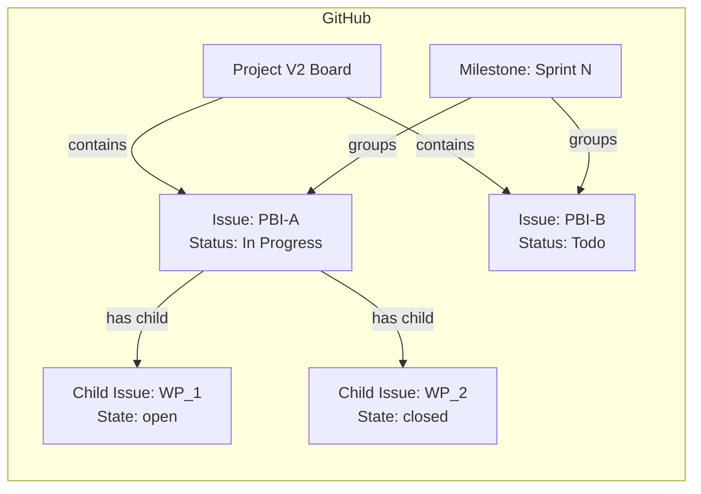

# Operations Guide

本ドキュメントは、Global Harness Manager の3階層スコープモデルを実際の開発現場で運用するための
**L1（運用ガイド）** です。
管理概念の**定義**（3階層スコープモデル・9概念・状態遷移・指標系・品質要件）は
[context/management.md](/.agents/context/management.md)
を**主**とし、本ガイドは**運用**（ワークフロー・ GitHub
上の表現・トラブルシューティング・責任者区分）に特化します。

本ガイドは、旧 `guides/operations-guide.md` と `guides/github-operations-guide.md`
を統合したものです（重複していた管理概念の定義は context へ参照化）。

## 1. 運用の枠組み

### 1.1. ワークフローとスキルの階層

運用フレームワークは、**ワークフロー**と**スキル**の二階層で構成されます。

**ワークフロー**は上位の概念であり、複数のスキルを適切な順序で呼び出して一連のプロセスを完結させます。ワークフローは各スキルの役割を熟知しており、目的に応じて必要なスキルを選択・実行します。

**スキル**は下位の概念であり、3階層スコープモデルの各概念（PBI、WP、Review、Retrospective
等）に対する単一の操作を担当します。スキルは自身が呼び出し元（ワークフロー）を意識することなく、与えられた役割を実行します。

```
ワークフロー（sprint-start / session-start 等）
    └── スキル（PBIの作成、WPの状態変更、Reviewの作成 等）
            └── 3階層スコープモデルの各概念
```

人間は個々のスキルを直接呼び出すのではなく、ワークフローに対して「スプリントを開始して」「このセッションを計画して」と指示するだけで、一連のプロセスが自動的に進行します。

### 1.2. AIに指示する操作一覧

本フレームワークでは、以下のワークフローを AI
に指示することができます。人間は意思決定と価値基準に責任を持ち、AI
は情報取得・表示・プログラミングの実行に責任を持ちます。

| 指示            | 責任主体                                      | 概要                                                                                              | 実行タイミング                   |
| --------------- | --------------------------------------------- | ------------------------------------------------------------------------------------------------- | -------------------------------- |
| `project-setup` | AI主導／各段階で人間確認                      | AI 実行基盤の構築、各種ボード・ラベル・ブランチ保護ルールの設定                                   | プロジェクト初期化時（初回のみ） |
| `kickoff`       | 人間主導（意思決定）／AI支援（記録）          | プロジェクトの情熱検証、ビジョン策定、技術選定を段階的に実行。Vision／Product Goal 等が作成される | プロジェクト開始時               |
| `sprint-start`  | 人間主導（PBI選択・AC定義）／AI実行           | バックログリファインメント、AC定義、スプリント計画、タイムボックス作成とPBIの状態更新             | 各スプリント開始時               |
| `sprint-end`    | 人間主導（レビュー判断・KPT）／AI実行（記録） | スプリントレビュー、Done PBI のアーカイブ、ベロシティ記録、予実評価、KPT                          | 各スプリント終了時               |
| `session-start` | AI主導／各段階で人間承認                      | ビジョンと能力の同期、WP特定、実装計画策定。WP が作成され、進捗状態が更新される                   | 各セッション開始時               |
| `session-end`   | AI主導（要約・記録）                          | セッション成果の要約、KPT、メトリクス記録。WP の進捗状態が更新される                              | 各セッション終了時               |

### 1.3. 対応マトリクス——操作×発行物

**操作 × 発行物 マトリクス**

各操作の実行時に、各発行物が果たす役割を示します（状態遷移の定義は context §3 を参照）。

| 操作            | Vision | Product Goal | Sprint Goal | PBI                        | WP             | Review   | Retrospective  |
| --------------- | ------ | ------------ | ----------- | -------------------------- | -------------- | -------- | -------------- |
| `project-setup` | —      | —            | —           | —                          | —              | —        | —              |
| `kickoff`       | 策定   | 策定         | —           | 発案                       | —              | —        | —              |
| `sprint-start`  | —      | 見直し       | 設定        | 発案、スプリントにコミット | 作業単位を定義 | 枠を作成 | 枠を作成       |
| `session-start` | —      | —            | —           | 開発中                     | 実装を実行     | —        | —              |
| `session-end`   | —      | —            | —           | 完了                       | 完了を報告     | —        | —              |
| `sprint-end`    | —      | —            | 達成を確認  | アーカイブ                 | アーカイブ     | 承認     | 振り返りを記録 |

**作成／アーカイブマトリクス**

各発行物の作成とアーカイブのタイミングを示します。

| 発行物            | 作成           | アーカイブ   |
| ----------------- | -------------- | ------------ |
| **Vision**        | `kickoff`      | —            |
| **Product Goal**  | `kickoff`      | —            |
| **Sprint Goal**   | `sprint-start` | `sprint-end` |
| **PBI**           | `kickoff`      | `sprint-end` |
| **WP**            | `sprint-start` | `sprint-end` |
| **Review**        | `sprint-start` | `sprint-end` |
| **Retrospective** | `sprint-start` | `sprint-end` |

## 2. GitHub 上の表現と操作

管理概念（3階層スコープモデル）が GitHub Issues/Projects V2
上でどのように表現され、各ワークフローの実行時に何が作成・更新されるかを説明します。

### 2.1. 3層モデルとGitHub上の表現

| 層             | 概念                          | GitHub上の表現                                                               | 作成タイミング                                 |
| -------------- | ----------------------------- | ---------------------------------------------------------------------------- | ---------------------------------------------- |
| プロジェクト層 | Vision / Product Goal         | リポジトリ内 `VISION.md` / `product-backlog.md` で管理（GitHub Issue対象外） | `/kickoff` 実行時                              |
| プロジェクト層 | Epic / Feature（大規模PBI）   | Issue（`type:epic` / `type:feature` ラベル） + Project V2 の階層ビュー       | バックログリファインメント時                   |
| プロジェクト層 | リリース管理                  | Milestone（プロジェクト全体の区切り）                                        | 必要に応じて手動作成                           |
| スプリント層   | スプリント                    | Milestone（`Sprint N`）                                                      | `/sprint-start` の `github-sprint-init` スキル |
| スプリント層   | スプリントにコミットされたPBI | Issue（`type:PBI` ラベル） + Milestone に紐付け                              | `/sprint-start` の `github-pbi-commit` スキル  |
| スプリント層   | PBIの状態管理                 | Project V2 内蔵Status（Todo / In Progress / Done）                           | 各ワークフローで自動更新                       |
| スプリント層   | PBIのアーカイブ               | DONEのPBI Issue を Close（`github-pbi-archive`）                             | `/sprint-end` 実行時                           |
| スプリント層   | スプリントレビュー結果        | Issueコメント / Project V2 のカスタムフィールド                              | `/sprint-end` 実行時                           |
| セッション層   | Work Package                  | 子Issue（sub-issue, `type:wp` ラベル）                                       | セッション開始時に通知                         |
| セッション層   | セッション計画                | Issue body 内の AC チェックリスト                                            | `/session-start` の `session-planning` スキル  |
| セッション層   | 実装進捗                      | 子Issueの Open/Close 状態                                                    | task.md駆動の実装でのAC完了時                  |
| セッション層   | セッション成果                | Issueコメント + Project V2 フィールド更新                                    | `/session-end` の `github-pbi-update` 等       |

### 2.2. ワークフロー別 GitHub 操作フロー

#### `/sprint-start`

1. **`github-sprint-init`**: 新規 Milestone `Sprint N` を作成する
2. **`github-pbi-search`**: 将来のバックログから対象PBIを検索する
3. **`github-pbi-update`**: 選択されたPBIの Milestone を Sprint N に設定する
4. **`github-pbi-commit`**: PBIのステータスを `todo` に設定する

#### `/session-start`

1. **`github-wp-search`**: 親PBIに紐づく未完了WPを検索する
2. 該当WPの Issue に実装計画（ACリスト）をコメント追記する
3. PBI Issue の Status を `In Progress` に更新する

#### task.md駆動の実装

1. AC完了に応じて子Issueを Close する
2. PBI Issue の body 内 AC チェックボックスを更新する
3. WIPコミットとして進捗を保存する（GitHub上ではコミットとして記録）

#### `/session-end`

1. **`github-wp-update`**: 該当WPの子Issueステータスを更新する
2. **`github-pbi-update`**: PBI Issue の Status フィールドを反映する
3. セッションメトリクスを Issue コメントとして記録する

#### `/sprint-end`

1. **`github-sprint-review-plan`**: Sprint N の全PBI一覧を取得する
2. **`github-pbi-archive`**: DONEのPBI Issue を Close する
3. **`github-sprint-velocity-record`**: ベロシティ情報を記録する

### 2.3. Projects V2 ボードの活用

Projects V2 では、フィールドを活用して状態管理を行います。

| フィールド | 説明                            | 値の例                        |
| ---------- | ------------------------------- | ----------------------------- |
| Title      | Issueのタイトル（PBI名を入力）  | `PBI-Name`                    |
| Status     | PBIの進捗状態（Project V2内蔵） | `Todo`, `In Progress`, `Done` |
| Milestone  | 所属スプリント                  | `Sprint 12`                   |
| Assignees  | 担当者                          | （任意）                      |
| Labels     | 種別ラベルのみ                  | `type:PBI`                    |

カスタムフィールド `harness-*`（size / effort / metrics / kpt 等）の一覧・所属ボードは
[field-registry.ts](/.agents/core/gateway/field-registry.ts) を唯一の正とする。

#### 状態遷移とビューの活用

Project V2 ボードでは、**Status
フィールド**を軸に以下のビューを設定することで、一覧で状態を俯瞰できます：

| ビュー名             | フィルタ条件                                                          | 活用シーン                    |
| -------------------- | --------------------------------------------------------------------- | ----------------------------- |
| スプリントバックログ | Milestone = `Sprint N`, Status != `Done`                              | スプリント中に対象のPBI一覧   |
| 未着手候補           | Status = `Backlog`                                                    | 将来のスプリントで検討するPBI |
| 未着手（コミット済） | Status = `Todo`                                                       | 次の着手候補の選定            |
| 進行中PBI            | Status = `In Progress`                                                | 日次の進捗確認・滞りの発見    |
| 完了PBI              | Status = `Done`                                                       | スプリント終了時の成果確認    |
| 種別別               | Labels contains `type:epic` / `type:feature` / `type:PBI` / `type:wp` | 階層構造の把握                |
| サイズ別             | `harness-size-estimate` = XS / S / M / L / XL（Project V2フィールド） | 負荷分散の確認                |

**運用のポイント**:

- PBI Issue の Status は原則として手動操作不要（ワークフロー内で自動更新）。
- 各 Issue に紐づく子Issue（WP）の状態は、親Issueのコメント欄または sub-issues
  ツリーで確認できます。
- クロスプロジェクトで Projects V2 を利用する場合は、各 Issue の `repo`
  フィールドで所属リポジトリを識別します。
- ビューは「保存」することでチームメンバー間で共有可能です。

### 2.4. 状態遷移図



GitHub 上の状態表現は下記のとおりです。管理概念としての状態遷移の**定義**は context §3 を参照。

- **Backlog**: 将来のスプリントで実施を検討するPBI。Project V2 上で薄灰色表示。**管理概念の
  `Idea`（発案）に対応**。
- **Todo**: スプリント計画で実施すると決定し、コミットされたPBI。Project V2 上で灰色表示。
- **In Progress**: 現在開発中のPBI。Project V2 上で青色表示。子Issueの進捗で進行度を確認。
- **Done**: 全ACが完了しPO承認を得たPBI。Project V2 上で緑色表示。スプリント終了時に Close。

> **Note**: 従来のカスタムフィールド `harness-status`（IDEA/TODO/WIP/DONE）は削除された。Project V2
> 内蔵Status（Backlog/Todo/In
> Progress/Done）を使用する。管理概念の状態（`Idea/Todo/InProgress/Done`） と Project V2
> 内蔵Statusの対応は、初期状態以外は同名（Idea↔Backlog / Todo / In Progress /
> Done）。機械値（Internal Stage値 `idea|todo|inProgress|done`）との関係は context §3 を参照。

## 3. Entity 操作の責任者区分と dry-run

### 3.1. ワークフローごとの Entity 管理の流れ

各ワークフローが、プロジェクト管理概念 Entity（Vision / Product Goal / Sprint Goal / PBI / WP /
Review / Retrospective）をどの時点で・どの操作で管理するかの流れを概説する。※ Epic / Feature は
分類用の補助概念であり、ワークフローが直接操作しないため本 overview では扱わない。

#### `kickoff` — プロジェクト開始時に、方向性の Entity を確立する

- **Vision** を掲げ、**Product Goal** を設定する。以降の全判断基準の基盤となる。
- PBI の発案もここで行う（分類階層の設計含む）。

#### `sprint-start` — スプリントの枠組みと、実施計画の Entity を準備する

- **Sprint Goal** を設定し、スプリントの枠組みを作る。
- **PBI** をスプリントにコミット（Idea → Todo）し、**WP** に分解して定義する。
- **Review** と **Retrospective**
  の**枠を作成（計画）**する。枠はスプリント開始時に作り、内容の記録は `sprint-end` で行う。

#### `session-start` — セッションの対象 WP に着手する

- バックログから **WP** を1つ特定し、実装計画の承認後に **WP** を着手（Todo → InProgress）する。
- 最初の WP が着手された PBI は自動的に **InProgress** へ昇格する。

#### `session-end` — セッションの成果を WP に記録する

- **WP** の実績 effort・乖離理由を記録し、セッション KPT・セッションメトリクスを記録する。
- **WP** を完了（InProgress → Done）し、兄弟 WP が全て完了した **PBI** も完了する。

#### `sprint-end` — スプリントの成果を確定し、完了させる

- **Review** でスプリント目標の達成状況を検証・承認する。
- **Retrospective** に KPT・スプリントメトリクス（5指標）を記録する。
- PBI の effort 分析・実感サイズ確定・ベロシティ集計を行い、完了した **WP / PBI / Review /
  Retrospective / Sprint Goal** をアーカイブしてスプリントを終了する。

### 3.2. Entity 操作の責任者区分

各 Entity の操作は「PO との対話」「AI の推論」「スクリプト実行」の組合せで進み、ステップごとに
**責任者区分（AI自律 / PO確定 / 共同）**が定まる。原則は以下のとおり。

| 区分       | 意味                                               | 例                                                      |
| ---------- | -------------------------------------------------- | ------------------------------------------------------- |
| **AI自律** | AI がスクリプト実行で記録・更新する。PO 確認は不要 | WP の状態遷移、effort 記録、メトリクス集計              |
| **PO確定** | PO の意思決定・承認が必須                          | PBI の発案・コミット、AC の定義・承認、実感サイズの確定 |
| **共同**   | PO との対話で内容を確定し、AI が推論・記録する     | KPT の抽出、乖離レビューの作成、ベロシティ集計の解釈    |

**Retrospective 操作の責任者区分（主要なもの）**:

| 操作                | 区分     | 備考                                                                                    |
| ------------------- | -------- | --------------------------------------------------------------------------------------- |
| plan（枠作成）      | AI自律   | スプリント開始時に枠を自動作成。Sprint（Milestone）に紐付け、Retrospective Board へ追加 |
| recordSprintKpt     | **共同** | PO との対話で KPT 内容を確定し、AI が記録する                                           |
| recordSprintMetrics | **共同** | 定量評価スコアは PO との合意、ナラティブは AI が推論して記録                            |
| archive（保管する） | AI自律   | スプリント終了時に自動クローズ                                                          |

### 3.3. dry-run の Plan 出力の人間可読表示

各操作は、実実行の前に `--dry-run` で **Plan（実行計画）** を返す。AI はこの Plan を、そのまま JSON
のまま出力するのではなく、**人間が読みやすい形でチャットに表示**する。

- **summary**: 操作の要約（「◯◯ の計画後 effort を記録する」等）
- **steps**: 実行される手順の一覧（「Scope の解決 → WorkPackage の記録」等）

表示に際しては、対象 Entity・操作・変更内容を箇条書きで要約し、PO
が承認・却下を即断できるようにする。

## 4. トラブルシューティング

### 4.1. gh CLI 認証エラー

**症状**: `gh auth status` で `not logged in`、またはスキル実行時に認証エラー。

**原因と対処**:

| 原因                      | 対処                                        |
| ------------------------- | ------------------------------------------- |
| 未ログイン                | `gh auth login` でブラウザ認証を実行        |
| アカウント間違い          | `gh auth switch` で正しいアカウントに切替   |
| トークン期限切れ          | `gh auth refresh` でトークンを再発行        |
| SSH ではなく HTTPS を使用 | `gh auth setup-git` で Git プロトコルを設定 |

### 4.2. ラベル不整合

**症状**: Issue 作成時に期待したラベルが付与されない、または重複して付与される。

**原因と対処**:

- **ラベル未作成**: `setup-github-labels` スキルを実行して標準ラベルを一括作成します。
- **ラベル名のタイポ**: ラベル名は完全一致で指定します（例: `type:PBI`）。size関連は Project V2
  カスタムフィールド（`harness-size-estimate`）で管理する。
- **リポジトリ間の差異**: 各リポジトリに同じラベルセットが存在することを確認します。

### 4.3. Project Item と Issue の紐付け失敗

**症状**: Issue を作成したが Project V2 ボードに表示されない。

**原因と対処**:

- **Project に Issue が追加されていない**: `addToProject` が正しく実行されているか確認します。
- **Project のフィールド定義と Issue のラベル不一致**: Project V2 のカスタムフィールド定義と Issue
  の Labels を突合します。
- **クロスリポジトリ制約**: 異なるリポジトリの Issue を Project に追加する場合、Project が
  Organization レベルで作成されている必要があります。

### 4.4. Milestone 作成エラー

**症状**: `github-sprint-init` で Milestone 作成に失敗する。

**原因と対処**:

- **同名 Milestone が既存**: スプリント番号が重複していないか確認します。
- **権限不足**: リポジトリへの書き込み権限があるか確認します。

### 4.5. 子Issue（sub-issue）関連の注意点

- **sub-issues はパブリックベータ機能**です。GitHub の機能更新により挙動が変わる可能性があります。
- 子Issue の作成に失敗した場合、代わりに Issue body 内に `parent: #N` 形式で親子関係を記述する
  フォールバックが使用されます。
- 子Issue の一覧は親Issue ページの "Sub-issues" タブで確認できます（GitHub UI）。
